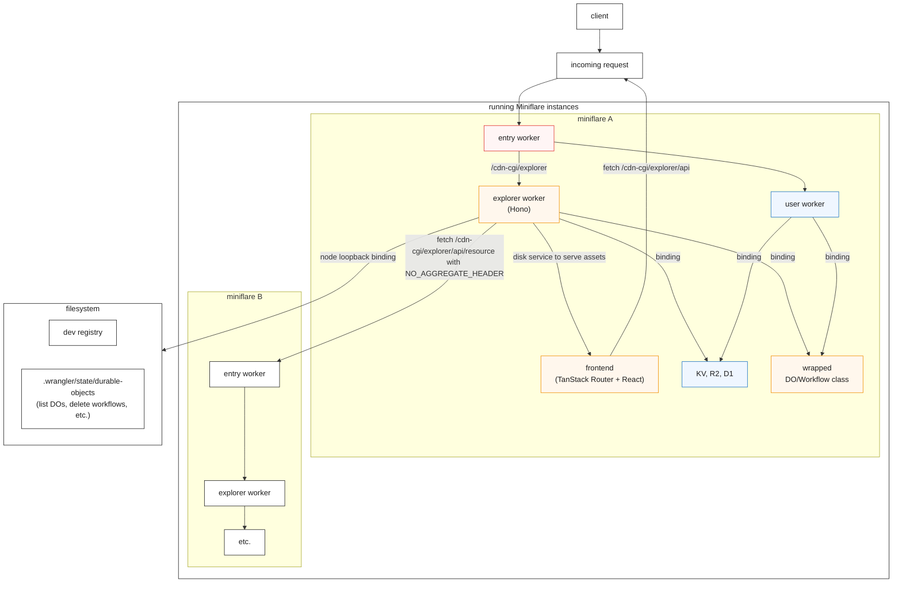

```mermaid
flowchart TB
	Client["client"] --> Incoming["incoming request"]
	Incoming --> EntryA["entry worker"]
	EntryA -->|/cdn-cgi/explorer| ExplorerA["explorer worker<br/>(Hono)"]

	subgraph Runtime["running Miniflare instances"]
		direction LR

		subgraph A["miniflare A"]
			direction TB
			EntryA
			ExplorerA
			Frontend["frontend<br/>(TanStack Router + React)"]
			UserWorker["user worker"]
			KV["KV, R2, D1"]
			Wrapper["wrapped<br/>DO/Workflow class"]

			EntryA --> UserWorker
			ExplorerA -->|disk service to serve assets| Frontend
			ExplorerA -->|binding| KV
			ExplorerA -->|binding| Wrapper
			UserWorker -->|binding| KV
			UserWorker -->|binding| Wrapper
		end

		subgraph B["miniflare B"]
			direction TB
			EntryB["entry worker"]
			ExplorerB["explorer worker"]
			Etc["etc."]

			EntryB --> ExplorerB
			ExplorerB --> Etc
		end
	end

	Frontend -->|fetch /cdn-cgi/explorer/api| Incoming
	ExplorerA -->|fetch /cdn-cgi/explorer/api/resource with NO_AGGREGATE_HEADER| EntryB

	subgraph FS["filesystem"]
		Registry["dev registry"]
		DOState[".wrangler/state/durable-objects<br/>(list DOs, delete workflows, etc.)"]
	end

	ExplorerA -->|node loopback binding| FS

	classDef miniflareA stroke:#f08c00,fill:#fff7ed,color:#1e1e1e;
	classDef userResource stroke:#1971c2,fill:#eff6ff,color:#1e1e1e;
	classDef entry stroke:#e03131,fill:#fff5f5,color:#1e1e1e;
	classDef neutral stroke:#1e1e1e,fill:#ffffff,color:#1e1e1e;

	class EntryA entry;
	class ExplorerA,Frontend,Wrapper miniflareA;
	class UserWorker,KV userResource;
	class Client,Incoming,Runtime,FS,Registry,DOState,EntryB,ExplorerB,Etc neutral;
```
