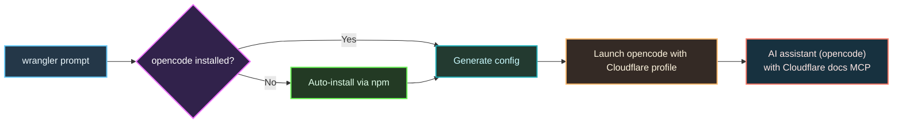
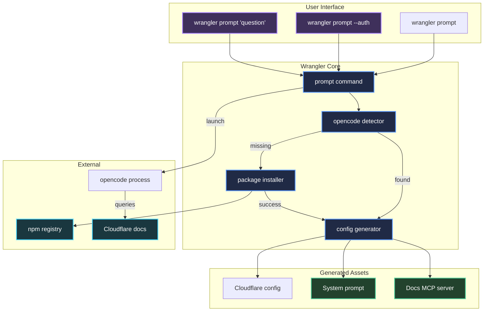
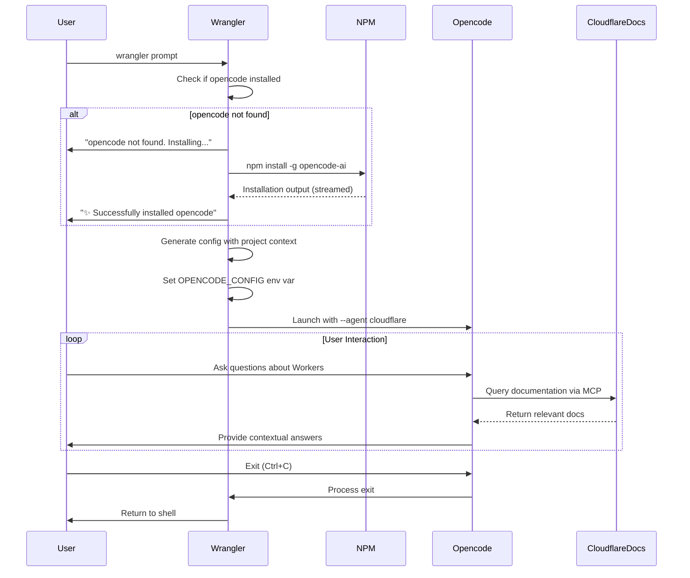

# Add `wrangler prompt` - AI Assistant powered by opencode

## Summary

Adds `wrangler prompt` command that launches [opencode](https://opencode.ai) AI assistant with Cloudflare Workers-specific system prompt and Cloudflare docs MCP server.

In the future, this can be expanded with additional system prompts, MCP prompts, and potentially more advanced behavior using [opencode plugins](https://opencode.ai/docs/plugins/).

## What This Does

- `wrangler prompt` - Launch AI assistant with Cloudflare context
- `wrangler prompt "question"` - Launch with initial prompt
- `wrangler prompt --auth login/logout/list` - Manage authentication
- Auto-installs opencode if not present
- Pre-configures access to Cloudflare docs via MCP server

## Architecture



## Implementation

**File Structure:**

```
packages/wrangler/src/prompt/
├── index.ts              # Command definition and handler
├── opencode-manager.ts   # Detection and auto-installation
├── config-generator.ts   # opencode config generation
└── types.ts              # opencode config schema
```

**Generated Configuration:**

- Cloudflare-specialized agent (see: https://opencode.ai/docs/agents/)
- System prompt includes detected wrangler config file path
- Pre-configured MCP server for Cloudflare docs (`https://docs.mcp.cloudflare.com/mcp`)
- Temporary opencode config stored in `.wrangler/tmp/`

## Example Usage

```bash
# Basic usage
npx wrangler prompt

# With initial prompt
npx wrangler prompt "add a queue named my-queue to my worker"

# Authentication
npx wrangler prompt --auth login
```

## Testing

Currently no dedicated tests (experimental feature). Manual testing completed on macOS with npm.

# Diagrams




