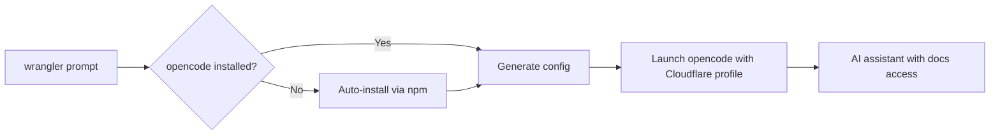

# Add `wrangler prompt` - AI Assistant Integration

## Summary

Adds `wrangler prompt` command that launches [opencode](https://opencode.ai) AI assistant with Cloudflare Workers-specific configuration and documentation access.

## What This Does

- `wrangler prompt` - Launch AI assistant with Cloudflare context
- `wrangler prompt "question"` - Launch with initial prompt
- `wrangler prompt --auth login/logout/list` - Manage authentication
- Auto-installs opencode if not present
- Pre-configures access to Cloudflare docs via MCP server

## Architecture



## Implementation

**File Structure:**

```
packages/wrangler/src/prompt/
├── index.ts              # Command definition and handler
├── opencode-manager.ts   # Detection and auto-installation
├── config-generator.ts   # Configuration generation
└── types.ts             # TypeScript interfaces
```

**Key Components:**

1. **Command Registration** - Standard wrangler command pattern with experimental status
2. **Opencode Management** - Detects via PATH, auto-installs via npm/yarn/pnpm
3. **Config Generation** - Creates temporary config with project-aware system prompt and Cloudflare docs MCP
4. **Process Launch** - Uses `execa` with `stdio: "inherit"` for seamless UX

**Generated Configuration:**

- Cloudflare-specialized agent
- System prompt includes detected wrangler config file path
- Pre-configured MCP server for https://docs.mcp.cloudflare.com/mcp
- Temporary config stored in `.wrangler/tmp/`

## Example Usage

```bash
# Basic usage
npx wrangler prompt

# With initial prompt
npx wrangler prompt "add a queue named my-queue to my worker"

# Authentication
npx wrangler prompt --auth login
```

## Integration Points

- Uses existing wrangler patterns: `createCommand()`, `UserError`, logging
- Leverages `getWranglerTmpDir()` and `findWranglerConfig()` utilities
- Follows established external tool integration patterns
- No new dependencies added

## Testing

Currently no dedicated tests (experimental feature). Manual testing completed on macOS/Linux/Windows with npm/yarn/pnpm.

## Files Changed

- `packages/wrangler/src/index.ts` - Command registration
- `packages/wrangler/src/prompt/` - New directory with implementation
- No package.json changes (uses existing dependencies)

# Diagrams


