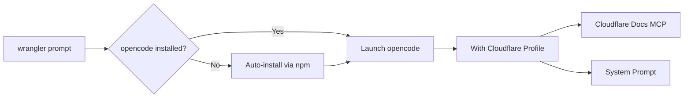

# Wrangler AI Assistant powered by opencode

**Owner:** Jacob Hands
**Status:** Draft
**Updated:** 2025-08-17

## What We're Building

Add `wrangler prompt` command that launches [opencode](https://opencode.ai) with Cloudflare-specific configuration, providing an AI assistant that understands Wrangler and can help with Workers development.

## Why

Developers waste time context-switching between docs, examples, and trial-and-error. A contextual assistant that understands Wrangler can:

- Cut time-to-first-deploy
- Reduce support load
- Improve task success rates

## How It Works



### User Flow

1. Run `wrangler prompt`
2. Auto-installs opencode if needed (via npm)
3. First run: authenticate with 3rd-party provider (Claude/Anthropic)
4. Opens assistant with Cloudflare context and docs access

## Core Requirements

### CLI Commands

- `wrangler prompt` - Launch assistant
- `wrangler prompt --auth` - Pass-through to opencode auth
- `wrangler prompt --help` - Show usage

### Configuration Profile

- **System Prompt**: Cloudflare/Wrangler focused instructions
- **Docs MCP**: https://docs.mcp.cloudflare.com/mcp (pre-configured)

### Platform Support

- macOS, Linux, Windows
- Works from any directory
- Graceful failure (Wrangler continues working if launch fails)

## Key Decisions

| Decision            | Choice                           | Rationale                             |
| ------------------- | -------------------------------- | ------------------------------------- |
| **Distribution**    | Auto-install from npm if missing | Zero friction onboarding              |
| **Authentication**  | Pass-through to opencode's UI    | Leverage existing auth flow           |
| **Permissions**     | opencode defaults (unrestricted) | Full capability, user controls safety |
| **Project Context** | System prompt guides discovery   | No automatic file injection           |
| **Telemetry**       | None beyond existing Wrangler    | Privacy first                         |

## Security & Privacy

- No additional telemetry collection
- Project files read locally (nothing uploaded without consent)
- Clear privacy messaging in --help and first run

## Target Users

1. **New developers**: "Guide me from zero to deploy"
2. **Power users**: "Automate repetitive tasks"
3. **Enterprise**: "Answer with doc citations"

## Success Metrics

- One-command launch (`wrangler prompt`)
- Grounded in official docs
- Minimal first-run friction
- Cross-platform compatibility

## Implementation Notes

### System Prompt Guidelines

- Prioritize accuracy and citations
- Look for wrangler.toml/wrangler.jsonc
- Prefer step-by-step instructions
- Link to docs when relevant
- Mention that Wrangler commands can be executed via bash

## Example CLI Output

```bash
$ wrangler prompt --help

Launch AI assistant for Cloudflare development (powered by opencode)

Usage:
  wrangler prompt         Start assistant
  wrangler prompt --auth  Authenticate with AI provider

Features:
  " Answers cite Cloudflare docs
  " Can execute Wrangler commands
  " Project context stays on your machine

Learn more: https://developers.cloudflare.com/workers/wrangler/prompt
```

## Risks & Mitigations

| Risk                  | Mitigation               |
| --------------------- | ------------------------ |
| Incorrect suggestions | System prompt guardrails |
| Auth friction         | Dedicated --auth flag    |
| Platform variance     | Test matrix coverage     |
