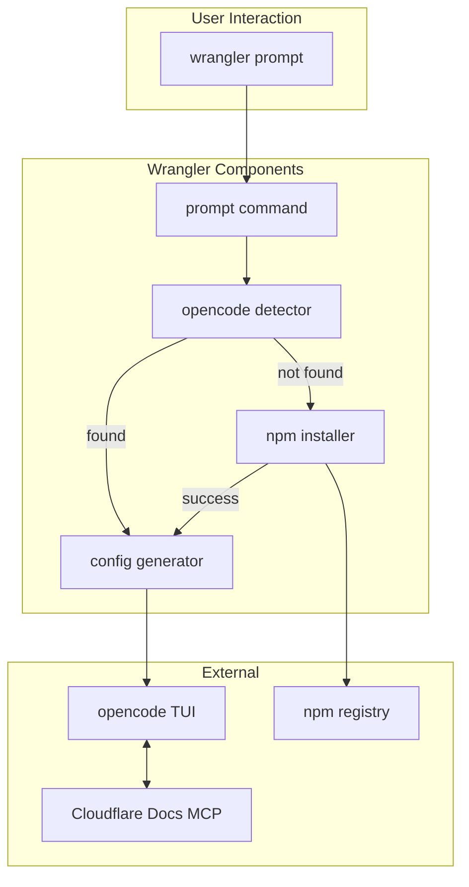

# Wrangler + Opencode Integration: Technical Specification

**Owner:** Jacob Hands
**Status:** Ready for Implementation
**Updated:** 2025-08-17

## Executive Summary

Add `wrangler prompt` command to launch [opencode](https://opencode.ai) AI assistant with Cloudflare-specific configuration. This provides developers with an AI assistant that understands their Cloudflare project context and can help with Workers development.

## Architecture Overview



## Requirements

### Functional Requirements

1. **Command Structure**

   - `wrangler prompt` - Launch opencode with Cloudflare profile
   - `wrangler prompt --auth` - Pass-through to opencode authentication
   - `wrangler prompt --help` - Display usage information

2. **Auto-Installation**

   - Detect if opencode is installed via PATH
   - Auto-install via `npm install -g opencode-ai` if missing
   - Provide clear error messages if installation fails

3. **Configuration Generation**
   - Generate temporary opencode configuration with:
     - Cloudflare-specific system prompt
     - Remote MCP server for Cloudflare docs
   - Configuration persists only for session duration

### Non-Functional Requirements

1. **Compatibility**
   - Support Windows, macOS, Linux
   - Work with npm, yarn, pnpm installations
   - Handle various shell environments

## Technical Design

### Milestone 1: Command Infrastructure

**Components:**

- Single command definition with `--auth` flag
- Integration with existing command registry

**Key Decisions:**

- Use `createCommand()` pattern (no namespace needed)
- Status: "beta" initially
- Owner: "Workers: Authoring and Testing"
- `--auth` flag to trigger authentication flow instead of normal launch

### Milestone 2: Opencode Detection & Installation

**Components:**

- Detection via `opencode --version` in PATH
- Installation via npm global install
- Progress feedback during installation

**Key Decisions:**

- Rely on PATH for detection (no hardcoded paths)
- Stream npm output with prefix for clarity
- Fail gracefully with manual installation instructions

### Milestone 3: Configuration Generation

**Components:**

- Temporary config file in `.wrangler/tmp/` directory with inline system prompt
- Remote MCP server configuration for docs

**Configuration Structure:**

```json
{
	"$schema": "https://opencode.ai/config.json",
	"agent": {
		"cloudflare": {
			"model": "anthropic/claude-sonnet-4-20250514",
			"prompt": "You are a helpful AI assistant specialized in Cloudflare Workers development...",
			"mode": "primary"
		}
	},
	"mcp": {
		"cloudflare-docs": {
			"type": "remote",
			"url": "https://docs.mcp.cloudflare.com/mcp"
		}
	}
}
```

**System Prompt Elements:**

- Cloudflare expertise declaration
- Current project context (working directory, wrangler config file detection)

### Milestone 4: Main Command Flow

**Execution Steps:**

1. Print Wrangler banner
2. Detect opencode installation
3. Install if needed (automatic)
4. Generate temporary configuration
5. Launch opencode with OPENCODE_CONFIG env var
6. Handle SIGINT for graceful shutdown

### Milestone 5: Help & Documentation

**Help Output Contents:**

- Usage examples
- Feature list
- First-run instructions
- Documentation link

### Milestone 6: Testing Strategy

**Unit Tests:**

- Opencode detection logic
- Configuration generation
- Error handling

**E2E Tests:**

- Full command flow (with mock opencode)
- Cross-platform compatibility

**Manual Testing:**

- Real opencode integration
- Various project configurations
- Error scenarios

## Implementation Plan

### Phase 1: Core Implementation (Day 1)

1. Command infrastructure and registration
2. Opencode detection and installation
3. Configuration generation
4. Main command orchestration
5. Help text and documentation

### Phase 2: Polish & Testing (Day 1)

1. Error handling improvements
2. Unit test coverage
3. E2E test implementation
4. Cross-platform validation

## Risk Mitigation

| Risk                  | Mitigation                                          |
| --------------------- | --------------------------------------------------- |
| Opencode API changes  | Pin to specific version, monitor for updates        |
| Platform differences  | Test on all platforms, use cross-platform libraries |
| Installation failures | Clear error messages, manual fallback instructions  |
| Docs MCP availability | Graceful degradation if docs server is down         |

## Success Criteria

1. **Functionality**

   - ✓ One-command launch (`wrangler prompt`)
   - ✓ Auto-installation works on all platforms
   - ✓ Configuration generation works correctly
   - ✓ Graceful error handling

2. **User Experience**

   - ✓ Clear progress indicators
   - ✓ Helpful error messages
   - ✓ Fast startup time (<5 seconds)
   - ✓ Clean shutdown

3. **Code Quality**
   - ✓ Follows existing Wrangler patterns

## Open Questions

1. Should we cache the opencode installation check?
2. Should we support custom model selection via flags?
3. Should we add telemetry for usage tracking?
4. Should we support workspace-specific configurations?

## Dependencies

- opencode-ai (npm package)
- Existing Wrangler infrastructure (logger, errors, config)

## File Structure

```
packages/wrangler/src/
├── prompt/
│   ├── index.ts                 # Command definition
│   ├── opencode-manager.ts      # Detection & installation
│   └── config-generator.ts      # Config generation with inline prompt
└── __tests__/
    └── prompt.test.ts           # Unit tests
```

## References

- [Opencode Documentation](https://opencode.ai/docs)
- [Wrangler Command Patterns](../src/core/README.md)
