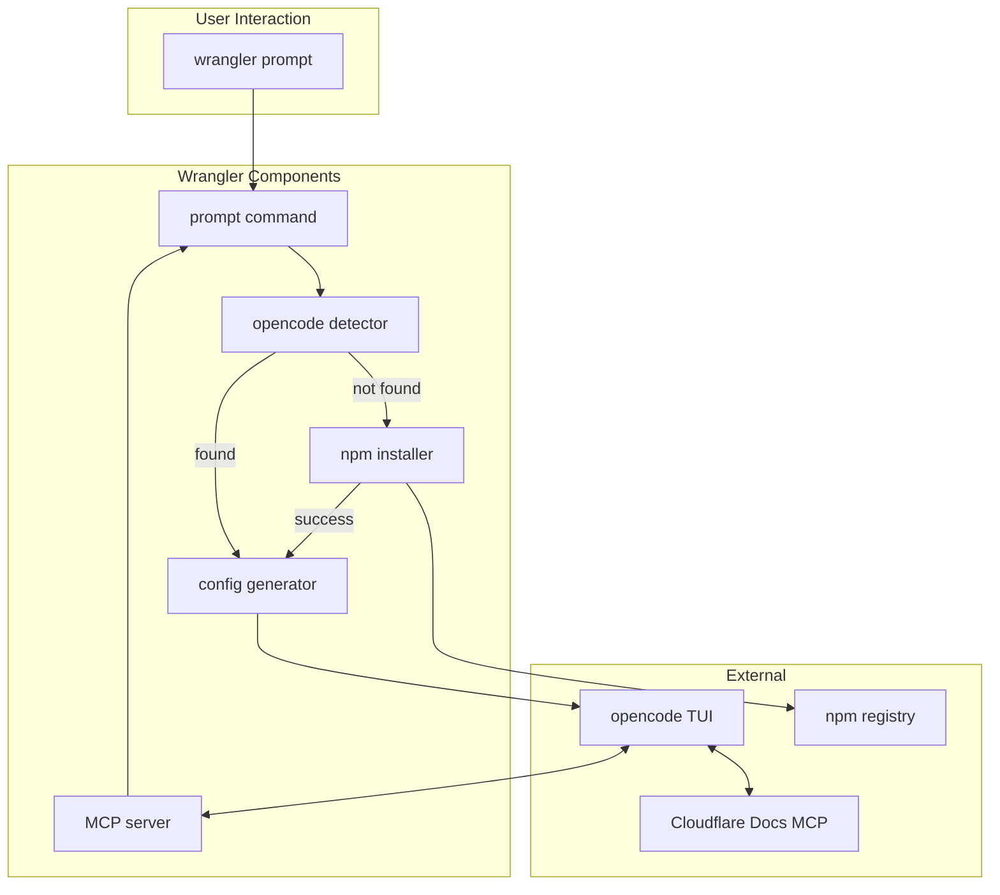

# Wrangler + Opencode Integration: Technical Specification

**Owner:** Jacob Hands
**Status:** Ready for Implementation
**Updated:** 2025-08-17

## Executive Summary

This specification details the implementation of `wrangler prompt`, a new command that launches [opencode](https://opencode.ai) with Cloudflare-specific configuration and a built-in local MCP server for Wrangler command execution.

## Architecture Overview



## Implementation Milestones

### Milestone 1: Command Infrastructure

**Goal:** Set up the basic `wrangler prompt` command structure

**Files to create/modify:**

- `packages/wrangler/src/prompt/index.ts` - Main command implementation
- `packages/wrangler/src/index.ts` - Command registration

**Implementation:**

```typescript
// packages/wrangler/src/prompt/index.ts
import { createCommand, createNamespace } from "../core";
import { UserError } from "../errors";

export const promptNamespace = createNamespace({
	metadata: {
		description: "> Launch AI assistant for Cloudflare development",
		status: "beta",
		owner: "Workers: Authoring and Testing",
	},
});

export const promptCommand = createCommand({
	metadata: {
		description: "Start AI assistant with local MCP server",
		status: "beta",
		owner: "Workers: Authoring and Testing",
	},
	behaviour: {
		printConfigWarnings: false,
	},
	async handler(args, { config }) {
		// Implementation in Milestone 2
	},
});

export const promptAuthCommand = createCommand({
	metadata: {
		description: "Authenticate with AI provider",
		status: "beta",
		owner: "Workers: Authoring and Testing",
	},
	async handler(args, { config }) {
		// Pass-through to opencode auth
	},
});
```

**Registration in index.ts:**

```typescript
// Add to imports
import { promptNamespace, promptCommand, promptAuthCommand } from "./prompt";

// Add to registry.define()
{ command: "wrangler prompt", definition: promptNamespace },
{ command: "wrangler prompt", definition: promptCommand },
{ command: "wrangler prompt auth", definition: promptAuthCommand },

// Register namespace
registry.registerNamespace("prompt");
```

### Milestone 2: Opencode Detection & Installation

**Goal:** Detect if opencode is installed, auto-install if needed

**Files to create:**

- `packages/wrangler/src/prompt/opencode-manager.ts` - Detection and installation logic

**Implementation:**

```typescript
// packages/wrangler/src/prompt/opencode-manager.ts
import os from "os";
import path from "path";
import chalk from "chalk";
import { execaCommand, execaCommandSync } from "execa";
import { UserError } from "../errors";
import { logger } from "../logger";

export async function detectOpencode(): Promise<boolean> {
	try {
		execaCommandSync("opencode --version", { stdio: "ignore" });
		return true;
	} catch {
		return false;
	}
}

export async function installOpencode(): Promise<void> {
	logger.log("=� Installing opencode-ai...");

	try {
		const res = execaCommand("npm install -g opencode-ai", {
			shell: true,
			env: {
				...process.env,
				npm_config_loglevel: "error",
			},
		});

		// Stream output with prefix
		res.stdout?.pipe(
			new Writable({
				write(chunk: Buffer, _, callback) {
					const lines = chunk.toString().split("\n").filter(Boolean);
					for (const line of lines) {
						logger.log(chalk.dim("[npm]"), line);
					}
					callback();
				},
			})
		);

		await res;
		logger.success(" opencode-ai installed successfully");
	} catch (error) {
		throw new UserError(
			"Failed to install opencode-ai. Please install manually: npm install -g opencode-ai",
			{ cause: error }
		);
	}
}

export function getOpencodePath(): string {
	// Check common installation paths
	const paths = [
		"/usr/local/bin/opencode",
		"/usr/bin/opencode",
		path.join(os.homedir(), ".npm/bin/opencode"),
		// Windows paths
		path.join(process.env.APPDATA || "", "npm", "opencode.cmd"),
	];

	for (const p of paths) {
		if (fs.existsSync(p)) return p;
	}

	// Fallback to PATH lookup
	return "opencode";
}
```

### Milestone 3: Configuration Generation

**Goal:** Generate temporary opencode configuration with Cloudflare profile

**Files to create:**

- `packages/wrangler/src/prompt/config-generator.ts` - Configuration generation
- `packages/wrangler/src/prompt/system-prompt.ts` - System prompt content

**Implementation:**

```typescript
// packages/wrangler/src/prompt/config-generator.ts
import { randomBytes } from "crypto";
import { writeFile } from "fs/promises";
import { tmpdir } from "os";
import { join } from "path";

interface OpencodeConfig {
	$schema: string;
	agent: Record<string, AgentConfig>;
	mcp: Record<string, McpServerConfig>;
}

interface AgentConfig {
	model: string;
	prompt: string;
	mode: "primary" | "subagent" | "all";
	temperature?: number;
}

interface McpServerConfig {
	type: "local" | "remote";
	command?: string[];
	url?: string;
	environment?: Record<string, string>;
	enabled: boolean;
}

export async function generateOpencodeConfig(
	mcpServerPort: number,
	projectPath: string
): Promise<string> {
	const configId = randomBytes(8).toString("hex");
	const configPath = join(tmpdir(), `wrangler-opencode-${configId}.json`);
	const systemPromptPath = join(tmpdir(), `wrangler-prompt-${configId}.txt`);

	// Write system prompt
	await writeFile(systemPromptPath, generateSystemPrompt(projectPath));

	const config: OpencodeConfig = {
		$schema: "https://opencode.ai/config.json",
		agent: {
			cloudflare: {
				model: "anthropic/claude-sonnet-4-20250514",
				prompt: `{file:${systemPromptPath}}`,
				mode: "primary",
				temperature: 0.7,
			},
		},
		mcp: {
			"cloudflare-docs": {
				type: "remote",
				url: "https://docs.mcp.cloudflare.com/sse",
				enabled: true,
			},
			wrangler: {
				type: "local",
				command: ["wrangler", "mcp-server", "--port", String(mcpServerPort)],
				environment: {
					WRANGLER_MCP_PORT: String(mcpServerPort),
					WRANGLER_MCP_MODE: "localhost",
				},
				enabled: true,
			},
		},
	};

	await writeFile(configPath, JSON.stringify(config, null, 2));
	return configPath;
}
```

```typescript
// packages/wrangler/src/prompt/system-prompt.ts
import { existsSync, readFileSync } from "fs";
import { join } from "path";

export function generateSystemPrompt(projectPath: string): string {
	const hasWranglerConfig =
		existsSync(join(projectPath, "wrangler.toml")) ||
		existsSync(join(projectPath, "wrangler.json")) ||
		existsSync(join(projectPath, "wrangler.jsonc"));

	return `You are a helpful AI assistant specialized in Cloudflare Workers development.

## Your Expertise
- Cloudflare Workers, Pages, R2, D1, KV, Durable Objects, and other Cloudflare products
- Wrangler CLI commands and configuration
- Workers development best practices
- Edge computing patterns and architectures

## Guidelines
1. **Accuracy First**: Always provide accurate information. Reference official Cloudflare documentation when available.
2. **Step-by-Step**: Break down complex tasks into clear, actionable steps.
3. **Best Practices**: Follow Cloudflare and Workers best practices in all suggestions.
4. **Error Messages**: When users share errors, help them understand and fix the root cause.
5. **Documentation Links**: Include relevant documentation links from https://developers.cloudflare.com when helpful.

## Current Context
- Working Directory: ${projectPath}
- Wrangler Config: ${hasWranglerConfig ? "Found" : "Not found"}
- Platform: ${process.platform}

## Available Tools
You have access to execute Wrangler commands through the MCP server. Use these to:
- Check project configuration
- Deploy Workers and Pages
- Manage resources (KV, R2, D1, etc.)
- Run development servers
- View logs and metrics

When executing commands, always:
1. Explain what the command will do
2. Show the exact command being run
3. Help interpret the output

## Important Notes
- Never expose or log sensitive information (API tokens, secrets, etc.)
- Prefer wrangler.toml over wrangler.json for new configurations
- Always validate configuration before deployment
- Use \`wrangler whoami\` to verify authentication when needed`;
}
```

### Milestone 4: MCP Server Implementation

**Goal:** Implement the local MCP server that executes Wrangler commands

**Files to create:**

- `packages/wrangler/src/prompt/mcp-server/index.ts` - MCP server entry point
- `packages/wrangler/src/prompt/mcp-server/server.ts` - Server implementation
- `packages/wrangler/src/prompt/mcp-server/tools.ts` - Tool definitions

**Dependencies to add to package.json:**

```json
{
	"dependencies": {
		"@modelcontextprotocol/sdk": "^1.15.1",
		"zod": "^3.23.0"
	}
}
```

**Implementation:**

```typescript
// packages/wrangler/src/prompt/mcp-server/index.ts
import { createCommand } from "../../core";
import { startMcpServer } from "./server";

export const mcpServerCommand = createCommand({
	metadata: {
		description: "Start MCP server for AI assistant integration",
		status: "beta",
		owner: "Workers: Authoring and Testing",
		hidden: true, // Internal command
	},
	args: {
		port: {
			type: "number",
			default: 0,
			description: "Port to bind to (0 for stdio)",
		},
	},
	async handler(args) {
		await startMcpServer(args.port);
	},
});
```

```typescript
// packages/wrangler/src/prompt/mcp-server/server.ts
import { Server } from "@modelcontextprotocol/sdk/server/index.js";
import { StdioServerTransport } from "@modelcontextprotocol/sdk/server/stdio.js";
import { execaCommand } from "execa";
import { z } from "zod";
import { logger } from "../../logger";

export async function startMcpServer(port: number) {
	const server = new Server({
		name: "wrangler-mcp",
		version: "1.0.0",
	});

	// Register the main execution tool
	server.setRequestHandler("tools/list", async () => ({
		tools: [
			{
				name: "wrangler_execute",
				description: "Execute a Wrangler CLI command",
				inputSchema: {
					type: "object",
					properties: {
						command: {
							type: "string",
							description:
								"The wrangler command to execute (without 'wrangler' prefix)",
						},
						cwd: {
							type: "string",
							description: "Working directory for command execution",
						},
					},
					required: ["command"],
				},
			},
			{
				name: "wrangler_config_read",
				description: "Read and parse wrangler.toml configuration",
				inputSchema: {
					type: "object",
					properties: {
						path: {
							type: "string",
							description: "Path to wrangler.toml file",
						},
					},
				},
			},
		],
	}));

	server.setRequestHandler("tools/call", async (request) => {
		const { name, arguments: args } = request.params;

		if (name === "wrangler_execute") {
			return await executeWranglerCommand(args.command, args.cwd);
		}

		if (name === "wrangler_config_read") {
			return await readWranglerConfig(args.path);
		}

		throw new Error(`Unknown tool: ${name}`);
	});

	// Start server with stdio transport
	const transport = new StdioServerTransport();
	await server.connect(transport);

	// Keep process alive
	process.stdin.resume();
}

async function executeWranglerCommand(
	command: string,
	cwd?: string
): Promise<{ content: Array<{ type: string; text: string }> }> {
	try {
		// Security: Validate command doesn't contain shell operators
		if (command.match(/[;&|<>]/)) {
			throw new Error("Command contains disallowed shell operators");
		}

		// Execute command
		const fullCommand = `wrangler ${command}`;
		const result = await execaCommand(fullCommand, {
			shell: true,
			cwd: cwd || process.cwd(),
			env: {
				...process.env,
				FORCE_COLOR: "0", // Disable color output for cleaner responses
			},
		});

		return {
			content: [
				{
					type: "text",
					text: result.stdout || "Command completed successfully",
				},
			],
		};
	} catch (error: any) {
		return {
			content: [
				{
					type: "text",
					text: `Error: ${error.message}\n${error.stderr || ""}`,
				},
			],
		};
	}
}

async function readWranglerConfig(
	path?: string
): Promise<{ content: Array<{ type: string; text: string }> }> {
	// Implementation to read and parse wrangler.toml
	// Uses existing wrangler config parsing logic
}
```

### Milestone 5: Main Command Handler

**Goal:** Implement the main handler that orchestrates everything

**Files to modify:**

- `packages/wrangler/src/prompt/index.ts` - Complete the handler implementation

**Implementation:**

```typescript
// packages/wrangler/src/prompt/index.ts (handler implementation)
import { detectOpencode, installOpencode, getOpencodePath } from "./opencode-manager";
import { generateOpencodeConfig } from "./config-generator";
import { getPort } from "../../utils/memoizeGetPort";
import { execaCommand } from "execa";
import { logger } from "../logger";
import { printWranglerBanner } from "../wrangler-banner";
import chalk from "chalk";

async handler(args, { config }) {
  await printWranglerBanner();

  // Step 1: Check for opencode
  if (!await detectOpencode()) {
    if (args["no-install"]) {
      throw new UserError(
        "opencode is not installed. Install it with: npm install -g opencode-ai"
      );
    }

    logger.log("=
 opencode not found, installing...");
    await installOpencode();
  }

  // Step 2: Get available port for MCP server
  const mcpPort = await getPort(0, "127.0.0.1");

  // Step 3: Generate configuration
  logger.log("�  Configuring AI assistant for Cloudflare development...");
  const configPath = await generateOpencodeConfig(mcpPort, process.cwd());

  // Step 4: Launch opencode
  logger.log("=� Launching opencode with Cloudflare profile...");
  logger.log(chalk.dim(`MCP server will be available on port ${mcpPort}`));

  const opencodePath = getOpencodePath();
  const opencodeProcess = execaCommand(opencodePath, ["--agent", "cloudflare"], {
    shell: false,
    env: {
      ...process.env,
      OPENCODE_CONFIG: configPath,
    },
    stdio: "inherit", // Pass through all I/O
  });

  // Handle cleanup on exit
  process.on("SIGINT", () => {
    opencodeProcess.kill("SIGINT");
    process.exit(0);
  });

  try {
    await opencodeProcess;
  } catch (error: any) {
    if (error.signal === "SIGINT") {
      // Normal exit
      return;
    }
    throw new UserError(
      "opencode exited unexpectedly. Check the logs above for details.",
      { cause: error }
    );
  }
}

// Auth command handler
async handler(args, { config }) {
  const opencodePath = getOpencodePath();

  if (!await detectOpencode()) {
    throw new UserError(
      "opencode is not installed. Run 'wrangler prompt' to install it automatically."
    );
  }

  // Pass through to opencode auth
  const authProcess = execaCommand(opencodePath, ["auth", "login"], {
    stdio: "inherit",
  });

  await authProcess;
}
```

### Milestone 6: Help Text & Documentation

**Goal:** Add comprehensive help text and user documentation

**Files to create:**

- `packages/wrangler/src/prompt/help.ts` - Help text generation

**Implementation:**

```typescript
// packages/wrangler/src/prompt/help.ts
export function getPromptHelp(): string {
	return `
Launch AI assistant for Cloudflare development (powered by opencode)

Usage:
  wrangler prompt         Start assistant with local MCP server
  wrangler prompt auth    Authenticate with AI provider

Features:
   Answers cite Cloudflare docs
   Executes Wrangler commands locally
   Project context stays on your machine

First Run:
  1. Run 'wrangler prompt' to auto-install opencode
  2. Authenticate with your AI provider when prompted
  3. Start asking questions about your Workers project

Security:
  " MCP server binds to localhost only
  " No project data is uploaded without consent
  " Commands are executed with your local permissions

Learn more: https://developers.cloudflare.com/workers/wrangler/prompt
`;
}
```

### Milestone 7: Testing & Error Handling

**Goal:** Add comprehensive tests and error handling

**Files to create:**

- `packages/wrangler/src/__tests__/prompt.test.ts` - Unit tests
- `packages/wrangler/e2e/prompt.test.ts` - E2E tests

**Test Implementation:**

```typescript
// packages/wrangler/src/__tests__/prompt.test.ts
import { describe, expect, it, vi } from "vitest";
import { generateOpencodeConfig } from "../prompt/config-generator";
import { detectOpencode, installOpencode } from "../prompt/opencode-manager";

describe("wrangler prompt", () => {
	describe("opencode detection", () => {
		it("should detect installed opencode", async () => {
			vi.mocked(execaCommandSync).mockReturnValue({ stdout: "1.0.0" });
			expect(await detectOpencode()).toBe(true);
		});

		it("should handle missing opencode", async () => {
			vi.mocked(execaCommandSync).mockImplementation(() => {
				throw new Error("command not found");
			});
			expect(await detectOpencode()).toBe(false);
		});
	});

	describe("configuration generation", () => {
		it("should generate valid opencode config", async () => {
			const configPath = await generateOpencodeConfig(3000, "/test/path");
			const config = JSON.parse(await readFile(configPath, "utf-8"));

			expect(config.$schema).toBe("https://opencode.ai/config.json");
			expect(config.agent.cloudflare).toBeDefined();
			expect(config.mcp.wrangler.command).toContain("mcp-server");
		});
	});

	describe("MCP server", () => {
		it("should execute safe wrangler commands", async () => {
			// Test MCP server command execution
		});

		it("should reject unsafe commands", async () => {
			// Test security validation
		});
	});
});
```

## Security Considerations

### 1. MCP Server Security

- **Localhost only**: Server binds to 127.0.0.1
- **Command validation**: Reject shell operators (`;`, `|`, `&`, `>`, `<`)
- **No credential exposure**: Filter sensitive output
- **Process isolation**: Each command runs in separate process

### 2. Configuration Security

- **Temporary files**: Use OS temp directory with random names
- **File permissions**: Set 0600 on sensitive files
- **Cleanup on exit**: Remove temporary configuration files

### 3. Authentication Flow

- **Pass-through**: Never handle auth credentials directly
- **Provider isolation**: Let opencode manage provider auth

## Platform Considerations

### Windows

- Use `opencode.cmd` instead of `opencode`
- Handle path separators correctly
- Check `%APPDATA%\npm` for global installs

### macOS/Linux

- Standard PATH lookups
- Handle both system and user npm installs
- Support various shell environments

## Performance Optimizations

1. **Lazy loading**: Only import MCP server code when needed
2. **Port memoization**: Reuse port selection logic
3. **Stream output**: Don't buffer large command outputs
4. **Parallel operations**: Check opencode while generating config

## Error Messages

### User-Friendly Errors

```typescript
const ERROR_MESSAGES = {
	OPENCODE_NOT_FOUND:
		"opencode is not installed. Install with: npm install -g opencode-ai",
	INSTALL_FAILED:
		"Failed to install opencode. Please install manually and try again.",
	AUTH_REQUIRED: "Please authenticate first: wrangler prompt auth",
	MCP_START_FAILED: "Failed to start MCP server. Check if port is available.",
	CONFIG_GENERATION_FAILED:
		"Failed to generate configuration. Check permissions.",
};
```

## Rollout Strategy

### Phase 1: Beta Release

- Mark command as `status: "beta"`
- Limited documentation
- Collect user feedback

### Phase 2: Stability Improvements

- Fix reported issues
- Optimize performance
- Add telemetry (opt-in)

### Phase 3: General Availability

- Mark as `status: "stable"`
- Full documentation
- Integration with other Wrangler features

## Success Metrics

1. **Installation Success Rate**: >95% successful auto-installs
2. **Launch Success Rate**: >98% successful launches
3. **MCP Connectivity**: >99% successful MCP connections
4. **User Satisfaction**: Positive feedback in surveys

## Future Enhancements

1. **Project Context**: Auto-detect and include project structure
2. **Custom Prompts**: Allow users to customize system prompt
3. **Tool Extensions**: Add more specialized Wrangler tools
4. **Workspace Support**: Multi-project workspace handling
5. **Offline Mode**: Work without docs MCP server

## Appendix: File Structure

```
packages/wrangler/src/
 prompt/
    index.ts                 # Command definitions
    opencode-manager.ts      # Detection & installation
    config-generator.ts      # Config generation
    system-prompt.ts         # System prompt
    help.ts                  # Help text
    mcp-server/
        index.ts             # MCP command
        server.ts            # Server implementation
        tools.ts             # Tool definitions
 __tests__/
    prompt.test.ts           # Unit tests
 index.ts                     # Command registration
```

## Implementation Checklist

- [ ] Milestone 1: Command Infrastructure
- [ ] Milestone 2: Opencode Detection & Installation
- [ ] Milestone 3: Configuration Generation
- [ ] Milestone 4: MCP Server Implementation
- [ ] Milestone 5: Main Command Handler
- [ ] Milestone 6: Help Text & Documentation
- [ ] Milestone 7: Testing & Error Handling

Each milestone is designed to be completed incrementally with clear validation points.
