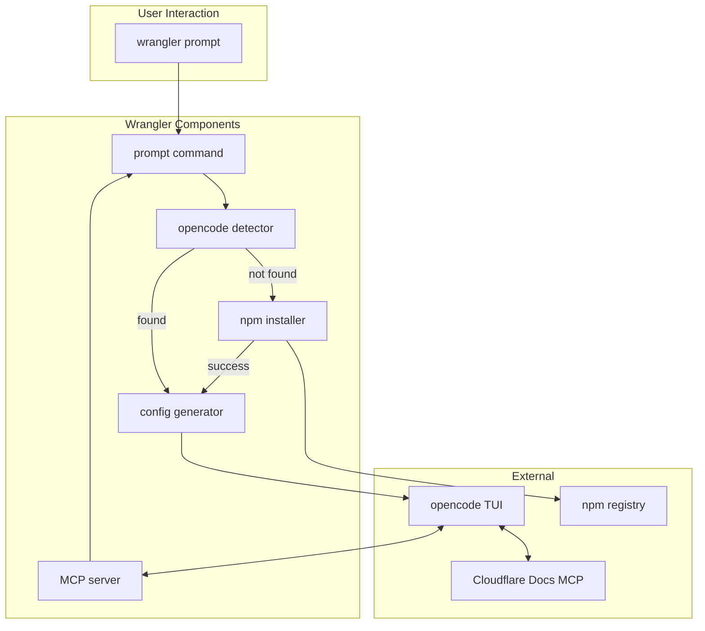

# Wrangler + Opencode Integration: Technical Specification

**Owner:** Jacob Hands
**Status:** Ready for Implementation
**Updated:** 2025-08-17

## Executive Summary

Add `wrangler prompt` command to launch [opencode](https://opencode.ai) AI assistant with Cloudflare-specific configuration and a local MCP server for Wrangler command execution. This provides developers with an AI assistant that understands their Cloudflare project context and can execute commands locally.

## Architecture Overview



## Requirements

### Functional Requirements

1. **Command Structure**
   - `wrangler prompt` - Launch opencode with Cloudflare profile
   - `wrangler prompt auth` - Pass-through to opencode authentication
   - `wrangler prompt --help` - Display usage information

2. **Auto-Installation**
   - Detect if opencode is installed via PATH
   - Auto-install via `npm install -g opencode-ai` if missing
   - Provide clear error messages if installation fails

3. **Configuration Generation**
   - Generate temporary opencode configuration with:
     - Cloudflare-specific system prompt
     - Remote MCP server for Cloudflare docs
     - Local MCP server for Wrangler commands
   - Configuration persists only for session duration

4. **MCP Server**
   - Implement local MCP server as hidden `wrangler mcp-server` command
   - Expose tool for executing Wrangler commands
   - Use stdio transport (JSON-RPC 2.0 protocol)
   - Validate commands for security (no shell operators)

### Non-Functional Requirements

1. **Security**
   - MCP server binds to localhost only
   - Command validation prevents shell injection
   - No credential storage or handling
   - Temporary files cleaned up on exit

2. **Performance**
   - Lazy loading of MCP server components
   - Stream command output without buffering
   - Reuse existing Wrangler infrastructure

3. **Compatibility**
   - Support Windows, macOS, Linux
   - Work with npm, yarn, pnpm installations
   - Handle various shell environments

## Technical Design

### Milestone 1: Command Infrastructure

**Components:**
- Command namespace and definitions following Wrangler patterns
- Integration with existing command registry

**Key Decisions:**
- Use `createNamespace()` and `createCommand()` patterns
- Status: "beta" initially
- Owner: "Workers: Authoring and Testing"

### Milestone 2: Opencode Detection & Installation

**Components:**
- Detection via `opencode --version` in PATH
- Installation via npm global install
- Progress feedback during installation

**Key Decisions:**
- Rely on PATH for detection (no hardcoded paths)
- Stream npm output with prefix for clarity
- Fail gracefully with manual installation instructions

### Milestone 3: Configuration Generation

**Components:**
- Temporary config file in OS temp directory
- System prompt with Cloudflare context
- MCP server configurations (local + remote)

**Configuration Structure:**
```json
{
  "$schema": "https://opencode.ai/config.json",
  "agent": {
    "cloudflare": {
      "model": "anthropic/claude-sonnet-4-20250514",
      "prompt": "{file:/path/to/system-prompt.txt}",
      "mode": "primary"
    }
  },
  "mcp": {
    "cloudflare-docs": {
      "type": "remote",
      "url": "https://docs.mcp.cloudflare.com/sse"
    },
    "wrangler": {
      "type": "local",
      "command": ["wrangler", "mcp-server"]
    }
  }
}
```

**System Prompt Elements:**
- Cloudflare expertise declaration
- Available tools explanation
- Security guidelines
- Current project context

### Milestone 4: MCP Server Implementation

**Protocol:** JSON-RPC 2.0 over stdio

**Tools to Expose:**
- `wrangler_execute`: Execute Wrangler commands
- `wrangler_config_read`: Read wrangler.toml configuration

**Dependencies:**
- `@modelcontextprotocol/sdk` ^1.15.1
- `zod` ^3.23.0 (for schema validation)

**Security Measures:**
- Reject commands with shell operators (`;|&<>`)
- Run in separate process per command
- Disable color output for cleaner responses

### Milestone 5: Main Command Flow

**Execution Steps:**
1. Print Wrangler banner
2. Detect opencode installation
3. Install if needed (automatic)
4. Generate temporary configuration
5. Launch opencode with OPENCODE_CONFIG env var
6. Handle SIGINT for graceful shutdown
7. Clean up temporary files on exit

### Milestone 6: Help & Documentation

**Help Output Contents:**
- Usage examples
- Feature list
- First-run instructions
- Security notes
- Documentation link

### Milestone 7: Testing Strategy

**Unit Tests:**
- Opencode detection logic
- Configuration generation
- Command validation
- Error handling

**E2E Tests:**
- Full command flow (with mock opencode)
- MCP server communication
- Cross-platform compatibility

**Manual Testing:**
- Real opencode integration
- Various project configurations
- Error scenarios

## Implementation Plan

### Phase 1: Core Implementation (Day 1)
1. Command infrastructure and registration
2. Opencode detection and installation
3. Configuration generation
4. Basic MCP server
5. Main command orchestration

### Phase 2: Polish & Testing (Day 1)
1. Error handling improvements
2. Help text and documentation
3. Unit test coverage
4. E2E test implementation
5. Cross-platform validation

## Risk Mitigation

| Risk | Mitigation |
|------|------------|
| Opencode API changes | Pin to specific version, monitor for updates |
| MCP protocol changes | Use official SDK, follow protocol spec |
| Platform differences | Test on all platforms, use cross-platform libraries |
| Security vulnerabilities | Command validation, localhost-only binding |
| Installation failures | Clear error messages, manual fallback instructions |

## Success Criteria

1. **Functionality**
   - ✓ One-command launch (`wrangler prompt`)
   - ✓ Auto-installation works on all platforms
   - ✓ MCP server executes commands correctly
   - ✓ Graceful error handling

2. **User Experience**
   - ✓ Clear progress indicators
   - ✓ Helpful error messages
   - ✓ Fast startup time (<5 seconds)
   - ✓ Clean shutdown

3. **Code Quality**
   - ✓ Follows existing Wrangler patterns
   - ✓ >80% test coverage
   - ✓ No security vulnerabilities
   - ✓ Well-documented

## Open Questions

1. Should we cache the opencode installation check?
2. Should we support custom model selection via flags?
3. Should we add telemetry for usage tracking?
4. Should we support workspace-specific configurations?

## Dependencies

- opencode-ai (npm package)
- @modelcontextprotocol/sdk
- Existing Wrangler infrastructure (logger, errors, config)

## File Structure

```
packages/wrangler/src/
├── prompt/
│   ├── index.ts                 # Command definitions
│   ├── opencode-manager.ts      # Detection & installation
│   ├── config-generator.ts      # Config generation
│   ├── system-prompt.ts         # System prompt
│   └── mcp-server/
│       ├── index.ts             # MCP command
│       └── server.ts            # Server implementation
└── __tests__/
    └── prompt.test.ts           # Unit tests
```

## References

- [Opencode Documentation](https://opencode.ai/docs)
- [MCP Protocol Specification](https://modelcontextprotocol.io)
- [Wrangler Command Patterns](../src/core/README.md)