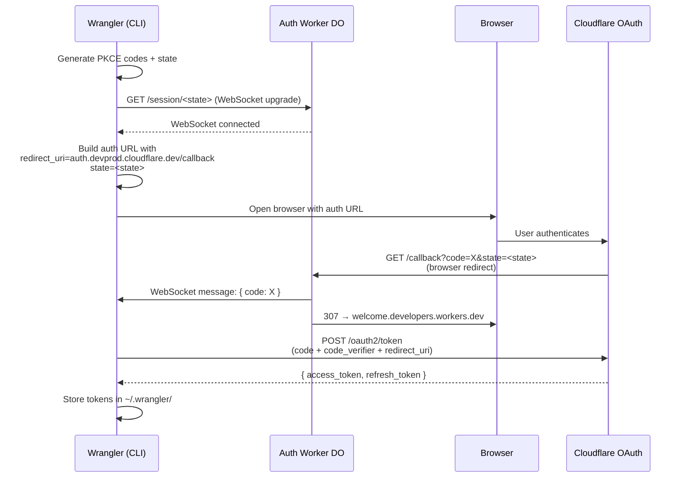

# `@cloudflare/cf-auth-worker`

A Cloudflare Worker that relays OAuth authorization codes between Wrangler and
the user's browser via a WebSocket. Deployed as a single tenant at
`auth.devprod.cloudflare.dev` and used by `wrangler login --experimental-websocket-callback`
(alias `--x-websocket-callback`).

## Why does this exist?

The default `wrangler login` flow runs a short-lived HTTP server on
`localhost:8976` and registers `http://localhost:8976/oauth/callback` as the
OAuth `redirect_uri`. That works on a developer's laptop but breaks in any
environment where the user's browser cannot reach the Wrangler process directly,
for example:

- A Docker container without an exposed `8976` port
- A remote VM, SSH session, or Codespace
- A locked-down CI sandbox where binding a localhost port is restricted

This worker removes the need for Wrangler to host its own callback server.
Instead, Wrangler opens a WebSocket to the relay and the OAuth callback is
delivered down that socket, so the only inbound connection Wrangler needs is the
already-established outbound WebSocket.

## How it works

Each login attempt creates an ephemeral session, identified by the OAuth
`state` parameter that Wrangler already generates (a 32-character cryptographic
random value). That same string is also used as the
[Durable Object][do] name, so each session lives in its own DO instance.



### Endpoints

The worker exposes two routes — anything else returns `404`:

| Method & path                  | Purpose                                                                                        |
| ------------------------------ | ---------------------------------------------------------------------------------------------- |
| `GET /session/:state`          | WebSocket upgrade from Wrangler. Routes to the DO via `idFromName(state)`. One socket per DO.  |
| `GET /callback?code=…&state=…` | OAuth callback from the browser. Forwards the code (or `error`) to the DO and `307`-redirects. |

### Browser redirects

After forwarding to the DO, the worker redirects the browser to the same
`welcome.developers.workers.dev` pages used by the localhost flow:

- Success → `https://welcome.developers.workers.dev/wrangler-oauth-consent-granted`
- Denied / no code / no connected WebSocket →
  `https://welcome.developers.workers.dev/wrangler-oauth-consent-denied`

The "no connected WebSocket" branch matters: if the DO has no listener (e.g.,
Wrangler crashed, network blip), the worker still returns the denied page so the
user isn't told the login succeeded when it didn't.

## Security

The relay was designed so that compromising it would not let an attacker steal
a user's Cloudflare credentials.

- **The relay never sees the access token.** It only sees the OAuth
  authorization _code_, which is single-use, short-lived, and useless without
  the matching PKCE `code_verifier` — and that verifier never leaves the
  Wrangler process.
- **State doubles as a CSRF token.** Wrangler generates a 32-character
  cryptographically random `state` per login. Wrangler also validates the
  returned `state` matches the one it generated.
- **One WebSocket per session.** A second `GET /session/:state` for the same
  state returns `409`. Because state is generated client-side and only sent to
  the OAuth provider via Wrangler-controlled URLs, an attacker cannot
  pre-occupy a session.
- **Five-minute TTL.** The DO sets an alarm on connect. If the callback never
  arrives, the alarm closes the WebSocket and the DO is garbage-collected.
- **No persistent state.** The DO holds nothing across logins. Once the
  callback has been forwarded the alarm is cleared and the WebSocket closes.

## Deployment

The worker is deployed (via the monorepo's `workers-sdk: { deploy: true }`
mechanism) to `auth.devprod.cloudflare.dev` as a custom domain. There is **no
staging or FedRAMP variant**:

- The worker is environment-agnostic — it relays opaque codes and never talks
  to Cloudflare's OAuth endpoints, so the same instance works for both
  production and staging Wrangler.
- OAuth login is already disabled in `fedramp_high` at the Wrangler CLI level
  (those users must use API tokens), so a FedRAMP relay would never be used.

The redirect URI (`https://auth.devprod.cloudflare.dev/callback`) must be
registered against both Wrangler OAuth client IDs at `dash.cloudflare.com`:

- Production client: `54d11594-84e4-41aa-b438-e81b8fa78ee7`
- Staging client: `4b2ea6cc-9421-4761-874b-ce550e0e3def`

## Automatic fallback to the local callback server

If the relay can't be reached when Wrangler tries to start the WebSocket flow,
Wrangler logs a warning and falls back to the existing local callback server
flow (`http://localhost:8976/oauth/callback`). This handles transient outages
and gracefully degrades for users on a regular laptop where the localhost
flow already works.

The behaviour is governed by a single env var:

| `WRANGLER_AUTH_WORKER_TIMEOUT` | Connect timeout                | Fall back on relay pre-open failure? |
| ------------------------------ | ------------------------------ | ------------------------------------ |
| (unset) / `5000` (default)     | 5s                             | ✅                                   |
| any positive number            | that many ms                   | ✅                                   |
| `0`                            | none (waits for relay forever) | ❌                                   |

Setting `WRANGLER_AUTH_WORKER_TIMEOUT=0` is useful in container/remote
environments where the localhost flow can't work anyway and you want
relay-only behaviour with a clear failure if the relay is unreachable.

Fallback only applies to **pre-open** failures (timeout, connect error,
premature close). Once the WebSocket has opened and Wrangler has launched
the user's browser, the user has committed to the relay's `redirect_uri`
and falling back would require restarting the entire flow with a new
authorisation. Failures from that point on (relay disappears mid-flow, the
120s authorisation timeout, etc.) propagate as normal errors with no
fallback.

## Developing

```sh
# from the repo root
pnpm install

# run the worker locally with `wrangler dev`
pnpm --filter @cloudflare/cf-auth-worker start

# run the test suite (vitest-pool-workers)
pnpm --filter @cloudflare/cf-auth-worker test:ci

# type check
pnpm --filter @cloudflare/cf-auth-worker check:type
pnpm --filter @cloudflare/cf-auth-worker type:tests
```

To point a local Wrangler build at a custom relay (for example, a `wrangler
dev` instance of this worker), set:

```sh
export WRANGLER_AUTH_WORKER_URL="http://127.0.0.1:8787"
```

Wrangler will use that URL for both the WebSocket connection and the
`redirect_uri` it sends to the OAuth server. (Note that the OAuth server must
also have your custom URL registered as an allowed redirect URI for testing
beyond the existing prod/staging registrations.)

## Files

| File                  | Purpose                                                                  |
| --------------------- | ------------------------------------------------------------------------ |
| `src/index.ts`        | Worker fetch handler — routing and `307` redirects                       |
| `src/auth-session.ts` | `AuthSession` Durable Object — WebSocket relay using the Hibernation API |
| `wrangler.jsonc`      | Worker config (custom domain, DO binding, migration)                     |
| `tests/`              | Vitest tests run via `@cloudflare/vitest-pool-workers`                   |

## Related code in Wrangler

The Wrangler side of this flow lives in
[`packages/wrangler/src/user/user.ts`](../wrangler/src/user/user.ts), in
`getOauthTokenViaWebSocket()`. The `--experimental-websocket-callback` flag is registered
in [`packages/wrangler/src/user/commands.ts`](../wrangler/src/user/commands.ts)
and the auth worker URL is configured via `getAuthWorkerUrlFromEnv()` in
[`packages/wrangler/src/user/auth-variables.ts`](../wrangler/src/user/auth-variables.ts).

[do]: https://developers.cloudflare.com/durable-objects/
