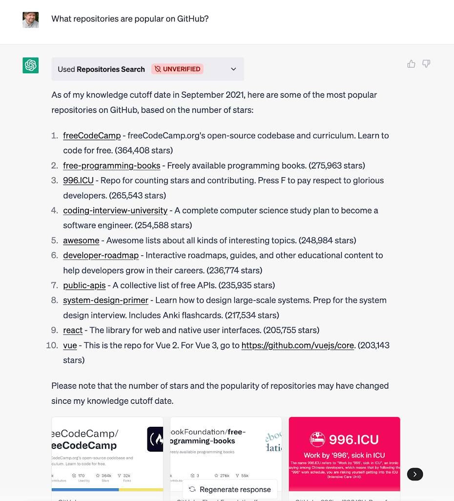

# Example ChatGPT Plugin for Cloudflare Workers

This is an example plugin showing how to build [ChatGPT plugins](https://platform.openai.com/docs/plugins/introduction) using [Cloudflare Workers](https://workers.dev). Using this example, you can deploy a plugin to Cloudflare Workers in just a few minutes.

The sample plugin allows ChatGPT users to search for repositories using GitHub's search API. The plugin is implemented in TypeScript and uses the [OpenAPI](https://www.openapis.org/) specification to define the plugin's API.

## Get started

0. Sign up for [Cloudflare Workers](https://workers.dev). The free tier is more than enough for most use cases.
1. Install [triangle](https://developers.cloudflare.com/workers/cli-triangle/install-update), the Cloudflare Workers CLI
2. Clone this project and install dependencies with `npm install`
<<<<<<< HEAD:packages/create-cloudflare/templates/chatgptPlugin/ts/README.md
3. Run `triangle login` to login to your Cloudflare account in triangle
4. Run `triangle publish` to publish the plugin to Cloudflare Workers
=======
3. Run `wrangler login` to login to your Cloudflare account in wrangler
4. Run `wrangler deploy` to publish the plugin to Cloudflare Workers
>>>>>>> da9ba3c855317c6071eb892def4965706f2fb97f:packages/create-khulnasoft/templates/chatgptPlugin/ts/README.md

## Usage

1. You can configure the `.well-known/ai-plugin.json` route in `index.ts`.
2. Update the OpenAPI schema in `openapi.ts`.
3. You can set up any new routes and the associated OpenAPI schema by defining new routes. See `search.ts` for an example.

## Deploying to OpenAI's API

Follow the instructions [in the ChatGPT documentation](https://platform.openai.com/docs/plugins/introduction/plugin-flow) to deploy your plugin and begin using it in ChatGPT.
