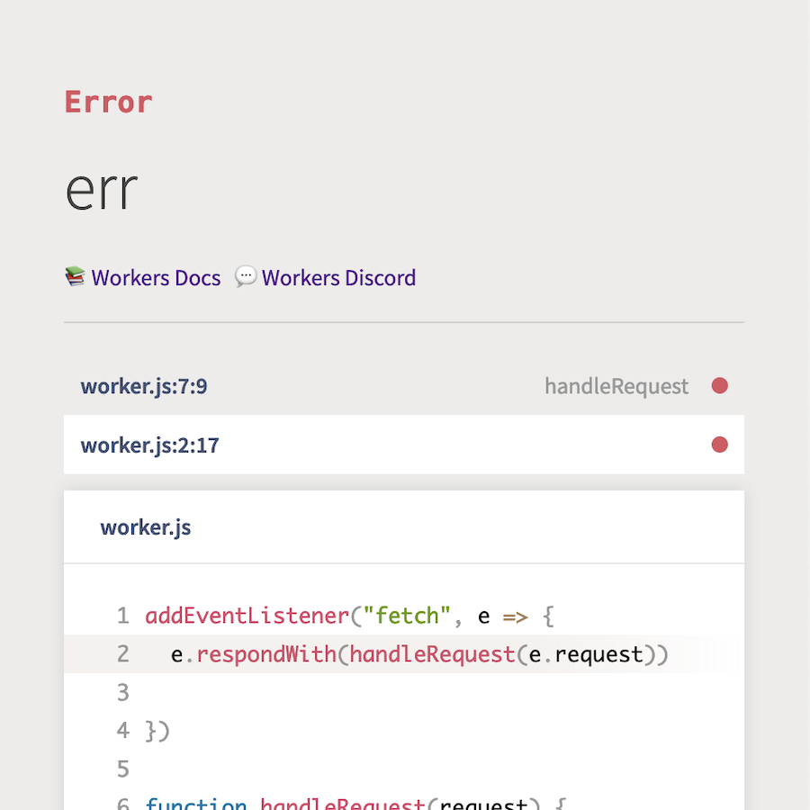
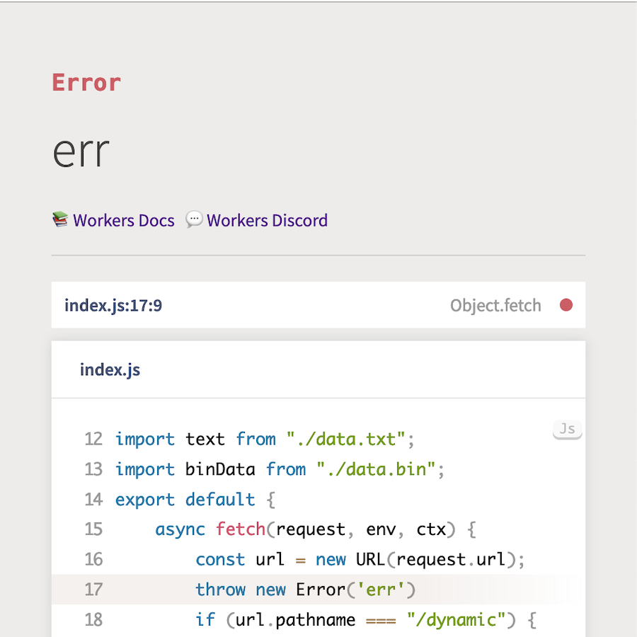

# format-errors

A Worker that will nicely format errors, optionally inflating with source context if available.

<table>
     <tr><td></td><td></td></tr>
</table>

## Why is this needed?

In development, it's nice to have good error messages to help when debugging, and ideally the logic for that shouldn't be bundled into your user Worker. This Worker is ~50kb when gzipped, which doesn't add _that_ much, but there's still a benefit to keeping it separate from the user Worker. Additionally, in environments where we're unable to bundle complex Workers, this error formatting Worker allows for the display of useful errors where otherwise only a stack trace would be available.

## How does it work?

Fundamentally, this is based on [Youch](https://github.com/poppinss/youch) and [StackTracey](https://github.com/xpl/stacktracey). Neither of these projects are designed to be run in the Workers environment (although StackTracey does have support for running in the browser), and so both have been vendored in and modified. These modifications aren't upstreamable, since they involve things like changing how Youch detects node-internal modules and changing how sources are loaded.

### Youch changes:

- **"internal" module detection:** By default, Youch recognises modules with a prefix of `node:` to be internal modules. Instead, `format-error`s recognises modules with a prefix of `.internal` as internal modules.
- **source loading:** Youch loads sources at error-page generation time, `format-error`s loads sources at error-page viewing time.
- **cookies:** `format-error`s doesn't handle cookies.

### Stacktracey changes:

- **browser detection:** `format-error`s always reports itself to be running inside a browser, but removes references to browser globals like `window`.
- **table rendering:** To remove the `as-table` dependency, `format-error` doesn't implement Stacktracey's `asTable` method, which Youch doesn't use.

## How can you get a formatted error page?

The first thing you'll need is an error. `format-errors` requires input conforming to the `Payload` interface below, and will reject invalid input at runtime:

```ts
export interface JsonError {
	message?: string;
	name?: string;
	stack?: string;
	cause?: JsonError;
}
export interface Payload {
	url?: string;
	method?: string;
	headers?: Record<string, string>;
	error?: JsonError;
}
```

To call `format-errors` (assuming it's hosted at `https://format-errors.example.com`), send a `POST` request to `https://format-errors.example.com` with a body containing a serialised `Payload` object. `format-errors` will parse your input, pass it to Youch, and generate an HTML page which will be sent back as the response to the `POST` request.

If you don't need source context, you can stop there! However, if you'd like to get rid of the "Missing sources" message, there's a bit more complexity.

> _Why can't I just pass sources to `format-error` in the request body?_
>
> Often your sources won't be available at the location where your error is thrown. You may have access to a sourcemap, but your running code probably doesn't have access to your source code in serialised format. As such, this package is geared towards supporting use cases where you have access to your sources at the time of _viewing_ the generated error page (i.e. in-browser editors).

A requirement of passing sources to `format-errors` is that the generated HTML error page needs to be embedded in an iframe. Once you've done that, you can start passing sources from the embedder of the iframe into the generated HTML error page.

Assuming `iframeEl` is a reference to the iframe which embeds the generated error page, here's an example of how you could pass sources to the generated error page:

```ts
const encoder = new TextEncoder();
const channel = new MessageChannel();

iframeEl.addEventListener("load", () => {
	iframeEl.contentWindow?.postMessage("PORT", "*", [channel.port2]);
});

channel.port1.onmessage = (data) => {
	if (data.type === "RequestSources") {
		const message = {
			type: "SourcesLoaded",
			body: {
				files: [
					{
						path: "index.js",
						contents: encoder.encode("console.log('hi')"),
					},
				],
				internalLines: 0,
			},
		};
		channel.port1.postMessage(
			message,
			message.body.files.map((f) => f.contents.buffer)
		);
	}
};
```

The interface is fairly simple. The embedder passes a `MessagePort` to the iframe on load, over which the error page requests sources. Of note: this does not currently support sourcemaps, and it's assumed that the lines within your error stack trace map to the exact line in your source.

There's one exception to that, to support _very_ limited source transformations, in the `internalLines` property. If you pass a value for `internalLines`, the error page will act as if any error messages from line numbers _below_ `internalLines` are internal, and shouldn't be surfaced to the user. Line numbers in error messages will be remapped so that it appears the user-visible source starts at line `0`, rather than line `internalLines`.
