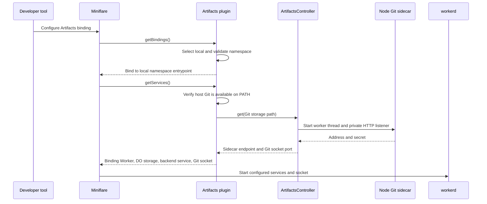
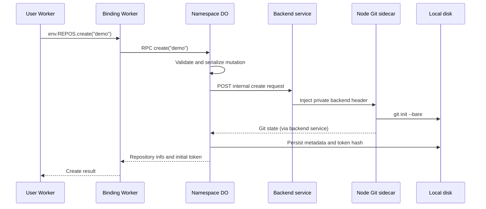
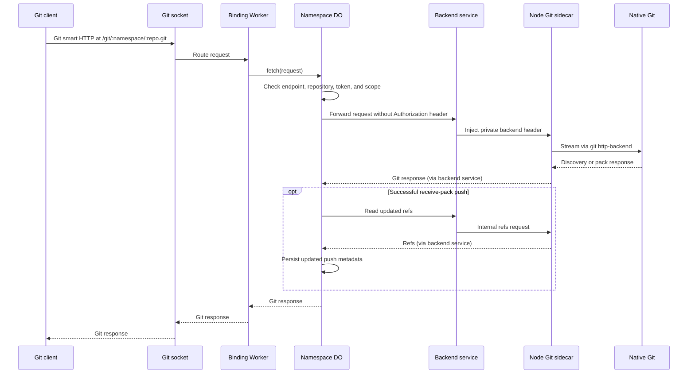
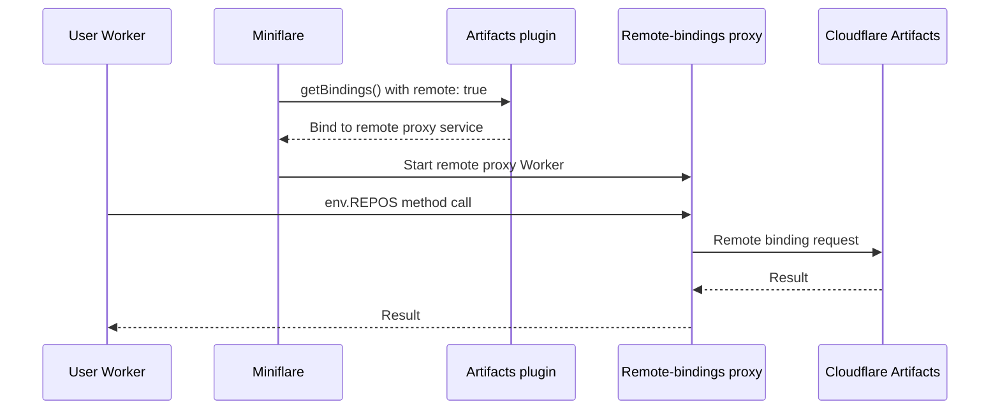

# Artifacts in Miniflare

The Artifacts plugin implements the local Artifacts binding in workerd. This
first version requires Git 2.32 or newer installed globally on the host and
available on PATH. Miniflare checks the Git version at local startup and gives
installation or upgrade instructions if needed. A Node worker thread runs the
native Git backend. Set `dev.remote` to `false` explicitly to select local
storage; an omitted setting retains remote binding behavior in this stage.
We plan to open-source a JavaScript Git engine in the future; it is not
included in this version.

## Local startup

`getBindings()` routes each local binding to a namespace-scoped service.
`getServices()` creates the binding Worker, namespace Durable Object, persistent
metadata disk, internal Git backend service, and Git socket. The controller
reuses a sidecar per Git storage path and closes it when Miniflare is disposed.
The socket used by Git clients and the sidecar's private HTTP listener are
**different endpoints**.

## Local binding RPC

For example, `env.REPOS.create("demo")`:

The Durable Object stores repository metadata and token hashes on local disk;
the sidecar stores the bare Git repositories separately. `git-sidecar.ts`
handles HTTP routing and repository locks, while `git-client.ts` owns
repository-scoped Git commands and result parsing. Read operations such as
`readFile()` also use the binding Worker and native Git backend. Node callers
reach the same binding through Miniflare's Node binding proxy. Namespace and
repository names are hashed into short, namespace-scoped on-disk paths; this
leaves room for Git packfiles and workerd SQLite files on platforms with path
length limits. Older draft storage layouts are not migrated automatically:
startup rejects a detected old layout rather than silently creating empty
repositories. Back up any local repositories before resetting the Artifacts
persistence directory. Do not delete the persistence directory without first
checking whether it holds work you need.

## Git clone and push

The binding Worker checks the supported Git endpoints and authenticates
repository tokens before forwarding. The internal service injects the sidecar
secret; the client's `Authorization` header is removed before that hop. For a
successful push, the Durable Object refreshes repository metadata before
returning the response. The sidecar uses native `git http-backend` for Git smart
HTTP rather than reproducing Git's pack protocol.

## Explicit remote binding

When `dev.remote` is `true`, this binding uses the remote-bindings proxy instead
of creating local Artifacts storage or a local Git sidecar for that namespace.

A local binding does not automatically synchronize with production Artifacts.
An explicit repository import may contact its specified HTTPS Git remote; that
is distinct from enabling a remote Artifacts binding.
