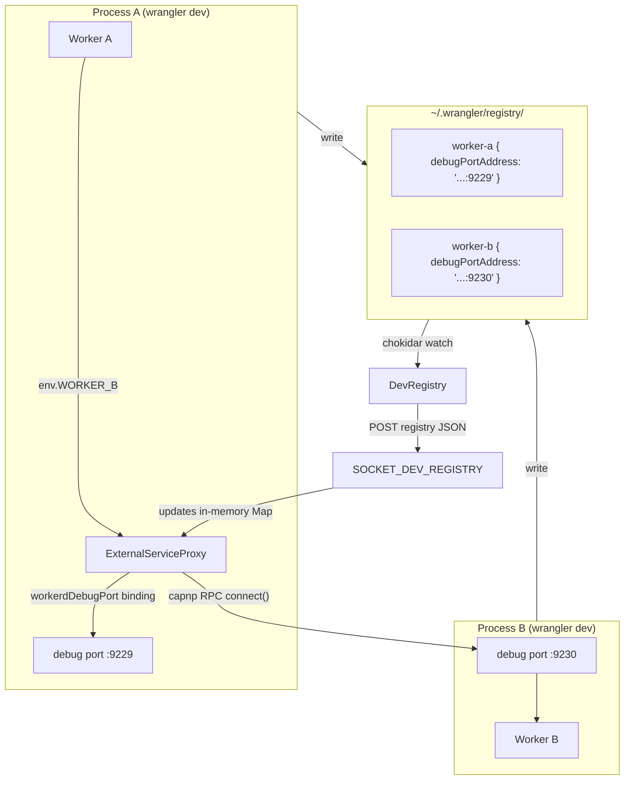
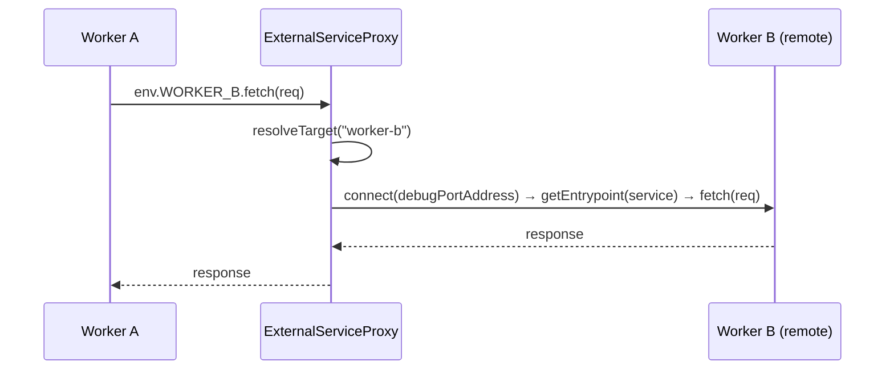
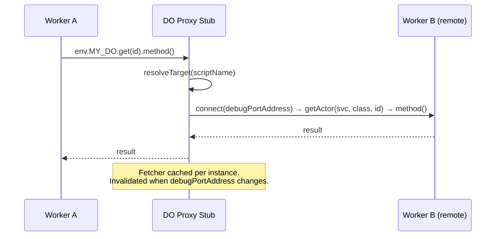

# Dev Registry Architecture

The dev registry enables cross-process communication between multiple `wrangler dev` / `vite dev` sessions running locally. When Worker A has a service binding to Worker B, and both are running in separate processes, the dev registry coordinates the connection.

## Overview

Each `wrangler dev` process writes its worker's connection info to a shared filesystem directory. When Worker A needs to talk to Worker B, a proxy worker inside A's workerd process reads B's debug port address from the registry and connects via Cap'n Proto RPC.



## Key Mechanism: Debug Port RPC

Each `workerd` process exposes a debug port (`--debug-port`) that provides native Cap'n Proto RPC access to all services and entrypoints within that process. The dev registry proxy uses the `workerdDebugPort` binding to connect to remote workers' debug ports, enabling:

- **Service binding fetch**: `env.OTHER_WORKER.fetch(request)`
- **RPC method calls**: `env.OTHER_WORKER.myMethod(args)`
- **Durable Object access**: Full DO lifecycle including RPC methods
- **Tail event forwarding**: Trace events forwarded via RPC

## Components

### Filesystem Registry (`dev-registry.ts`)

The `DevRegistry` class manages worker registration via the filesystem. Each running worker writes a JSON file to `~/.wrangler/registry/<worker-name>` containing its `WorkerDefinition`:

```typescript
type WorkerDefinition = {
	debugPortAddress: string; // e.g. "127.0.0.1:12345"
	defaultEntrypointService: string; // workerd service name for default entrypoint
	userWorkerService: string; // workerd service name bypassing asset proxies
};
```

- **Heartbeat**: Every 30s, the file's mtime is touched to signal that the Worker is still running.
- **Stale cleanup**: On every read, files older than 5 minutes are deleted (5 minutes is much longer than 30s just to provide a safe buffer)
- **Change detection**: Chokidar watches the registry directory. When a file changes, `refresh()` compares the new state against the previous JSON snapshot and fires `onUpdate` only if a watched external service actually changed.

### Proxy Worker (`dev-registry-proxy.worker.ts`)

A Worker that proxies requests to remote workers. It contains:

- **`ExternalServiceProxy`** -- A `WorkerEntrypoint` that resolves the target worker from the in-memory registry, connects via `workerdDebugPort`, and forwards `fetch()`, RPC calls, `scheduled()`, and `tail()`.
- **Registry update handler** -- The default export accepts `POST` requests with the full registry JSON, updating the in-memory `Map` without restarting workerd.

The proxy worker is generated dynamically in `Miniflare.#assembleAndUpdateConfig()`. Its main module is built from a template that bakes in the initial registry state and exports one `createProxyDurableObjectClass()` per external DO.

### Shared Proxy Logic (`dev-registry-proxy-shared.worker.ts`)

Contains the registry `Map`, `resolveTarget()`, `connectToActor()`, `createProxyDurableObjectClass()`, and tail event serializers. Shared between the service proxy and DO proxy classes.

### Registry Push (`Miniflare.#pushRegistryUpdate`)

When the filesystem watcher detects a change to an external service, Miniflare pushes the updated registry to the proxy worker via HTTP POST on a dedicated socket (`SOCKET_DEV_REGISTRY`). This avoids routing through the entry worker, which can break on Windows (WSARecv error 64).

The push always reads the latest registry state (not a captured snapshot) and retries up to 3 times with 500ms delays.

## Request Flow

### Service Binding Fetch



### RPC Method Call

Same as fetch, but the `Proxy` constructor on `ExternalServiceProxy` intercepts property access and delegates to the remote fetcher via `Reflect.get(fetcher, prop)`.

### Durable Object Access



### Scheduled Event

Scheduled events are forwarded via HTTP to the remote worker's `core:entry` service using the `MF-Route-Override` header pattern, and then run using the well-known `/cdn-cgi/handler/scheduled` path.

## Configuration

The proxy is only configured when `devRegistry.isEnabled()` returns `true` and there are external services. The workerd config includes:

- A `dev-registry-proxy` worker service with the `workerdDebugPort` binding
- One `durableObjectNamespace` per external DO class
- A dedicated `SOCKET_DEV_REGISTRY` HTTP socket for registry push updates
- External service bindings configured with `capnpConnectHost` pointing at the proxy's entrypoints

## Default Entrypoint Routing

The `defaultEntrypointService` in `WorkerDefinition` varies by worker type:

| Worker Type     | defaultEntrypointService   | Why                          |
| --------------- | -------------------------- | ---------------------------- |
| Plain worker    | `core:user:<name>`         | Direct access                |
| Worker + Assets | `assets:rpc-proxy:<name>`  | Routes through asset handler |
| Vite worker     | `core:user:<overrideName>` | `unsafeOverrideFetchWorker`  |

Named entrypoints and DO access always use `userWorkerService` (`core:user:<name>`) to bypass any asset/vite proxy layer.
