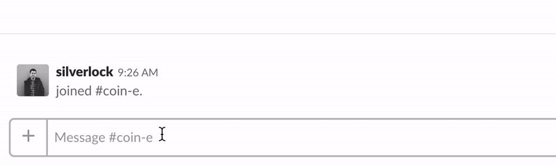

# Cryptocurrency Slack Bot

A [Slack bot](https://api.slack.com/slash-commands) for fetching the latest cryptocurrency prices, built entirely using [Cloudflare Workers](https://developers.cloudflare.com/workers/), Cloudflare's serverless platform

- It uses the [CoinMarketCap API](https://coinmarketcap.com/api/) to fetch crypto-currency prices
- It caches a map of "ticker" codes (e.g. "BTC" or "ETH") to their public identifiers
- ... and it uses Cloudflare's cache to minimize the need to hit the API on every invocation, whilst still serving recent price data.

## Demo

The bot easy to use: ask it for the price of your favorite cryptocurrency!

Ticker symbols and names rely on the currencies listed at [CoinMarketCap](https://coinmarketcap.com/all/views/all/).

## Setting up the bot

Setting up the bot as a Worker in your own Cloudflare account is easy. You'll need a Cloudflare account with Workers enabled (via the "Workers" app in the dashboard).

1.  [Create a Slack app](https://api.slack.com/slack-apps#creating_apps) as a slash command
2.  Create the Worker: copy the contents of `index.js` into a new Worker script
3.  Fetch the 'verification token' from your newly created Slack app, and replace the contents of `SLACK_TOKEN` at the top of your script.
4.  Create a new route that invokes the Worker (must be HTTPS) - e.g. `https://bots.example.com/cryptocurrencybot*`
5.  Update the Webhook URL in your Slack app configuration with this URL (minus the \*)
6.  Add the app [to your workspace](https://get.slack.help/hc/en-us/articles/202035138-Add-an-app-to-your-workspace).

## License

BSD 3-Clause licensed. See the LICENSE file for details.
