# Edge Cache HTML

Supports Edge-caching HTML for not-logged-in users in coordination with a Content Management System (CMS) that supports x-HTML-Edge-Cache headers (either directly or through a plugin). A plugin is provided for WordPress as an example.

Installation instructions are available [below](#Installation).

## How it works

- The worker processes all requests that come through it, adding an "x-HTML-Edge-Cache' header to the requests so that the origin will know that the edge-cache is enabled (and optionally what features it supports).
- If the origin responds with an "x-HTML-Edge-Cache" response header then the commands from the header are processed and the response is passed through unmodified to the user.
  - A `purgeall` command causes the cache to be cleared and is sent by the origin in response to changes to the content.
  - A `cache` command causes the page to be cached and future requests for the page will be served from the cache directly from the edge.
  - A `bypass-cookies` command can be combined with a cache command to specify cookie prefixes that should bypass the cache. This is mostly used to detect logged-in users which may get a different experience.

The worker cache is a local cache specific to each edge location but purge commands need to be able to purge the cache globally. The worker script handles cache purges in one of two ways:

1. (preferred) Using a cache version number that is stored in KV.
   - When requests come in, the current cache version is appended to the request URLs to generate versioned URLs for checking the cache (and for storing content in the cache).
   - When a purge command arrives, the cache version number is incremented in KV which causes the resource URLs to change.
   - Old cached content will be aged out of the cache naturally as it will no longer be accessed.
1. Using the Cloudflare API to purge the global cache for the zone. This clears the worker caches but also the regular cache for the zone including all of the images and scripts.

The worker cache respects the caching headers for any responses that are passed to the cache so we need to modify the responses to make them cacheable. When the HTML is stored in the cache the original cache headers are copied to new headers and replaced with headers that allow the page to be cached for a year. When the response is pulled out of cache the original headers are restored.

For the bypass-cookies support, when a response is retrieved from cache it is checked to see if it has a bypass-cookies command in the x-HTML_Edge-Cache response headers. If it does then the cookie prefixes are compared to any cookies on the request and if there is a match the cached response is discarded and the request is passed through to the origin (bypassing the cache). In theory this allows for different cookies and settings to be specified for different responses (though in practice it is pretty unlikely).

## Installation

Edge caching support requires a Cloudflare Worker script that runs on the edge as well as a content management system (like WordPress) that supports integrating with the worker. A plugin for WordPress support is available as part of this sample [here](WordPress%20Plugin/).

### Cache Purging

The worker purges the cache when content changes using one of two methods. If [Cloudflare Workers KV](https://www.cloudflare.com/products/workers-kv/) is enabled on the account and configured it is the preferred method as it only purges the HTML content when changes are detected, leaving other static resources in the cache (images, scripts, etc). If KV isn't available it can use the Cloudflare API to purge the cache for the zone but that clears the entire cache.

#### KV Cache Purging

For KV-based cache purging a KV namespace is needed. To configure a namespace go to the Workers tab on the Cloudflare dashboard and scroll to the bottom of the page.

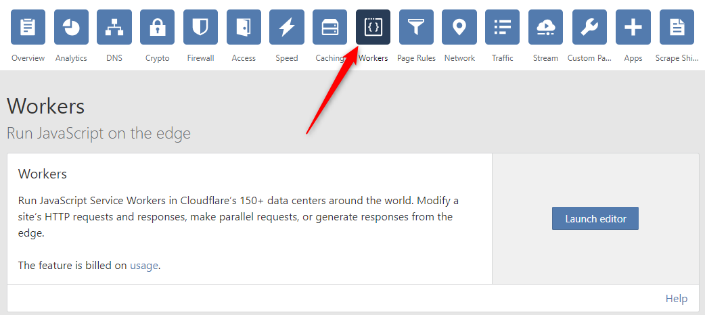

The name of the KV store doesn't matter - use something memorable and descriptive so you know what it was for. If you already have a KV store then that can also be reused as the Worker only uses a single key in the store (for storing the current cache version).

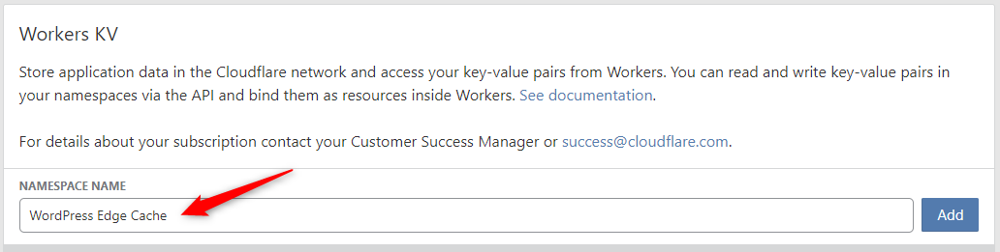

#### API

Purging using the API (only when KV is not available) requires configuring the script with an API key, account email address and zone ID. There is a section at the top of the script where each value should be entered.

The zone ID is available on the main dashboard page in a box in the bottom-right corner:

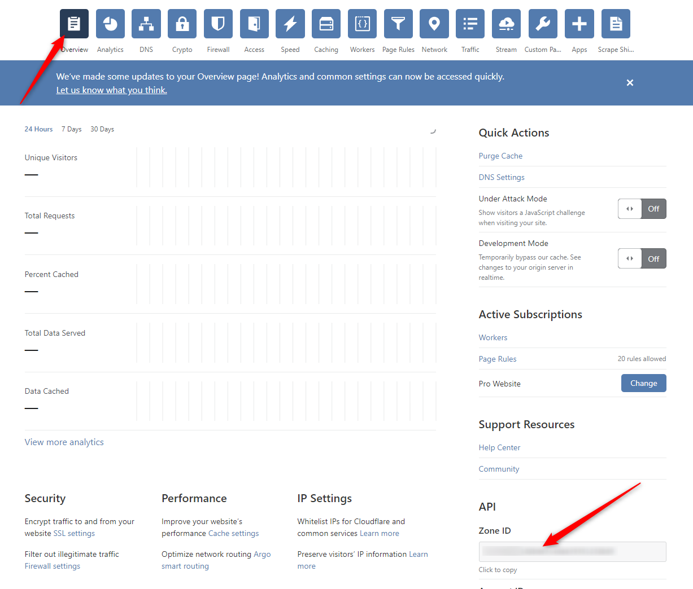

The account email address and API key are both available on the [profile page](https://dash.cloudflare.com/profile) for your account.

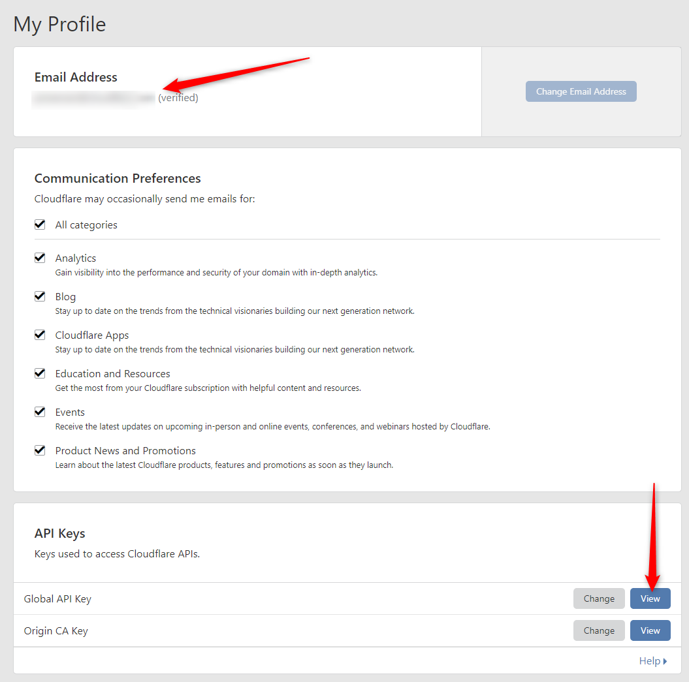

### Worker Script

Once the cache purging configuration is available it is time to actually install the worker script to run for your zone. That is done through the workers tab in the dashboard by clicking on the "Launch Editor" button.

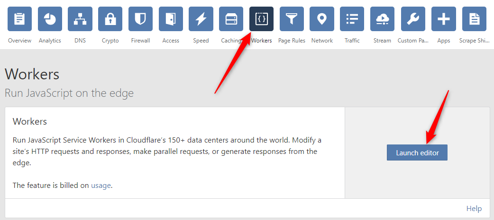

Your editor may look slightly different depending on the account level and if support for multiple worker scripts is enabled or not but the basics should be the same. To get to the actual script editor you will either click on a button to edit or add the script. In single-script mode it will launch directly into the script editing UI and there is no need to "Add".

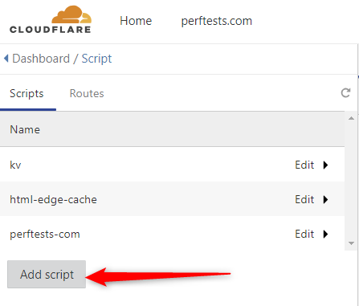

If you are using KV to purge the cache you need to bind the namespace to a variable in your worker named EDGE_CACHE. That is done through the "Resources" tab on the right side of the code editor window. The variable name MUST be EDGE_CACHE otherwise the script will not work. If you are using API cache purging then you can skip the key binding and go directly to inserting the worker code.

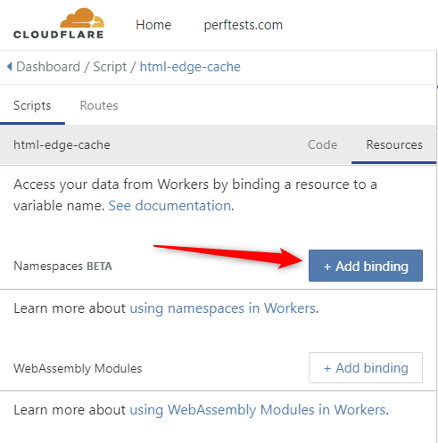

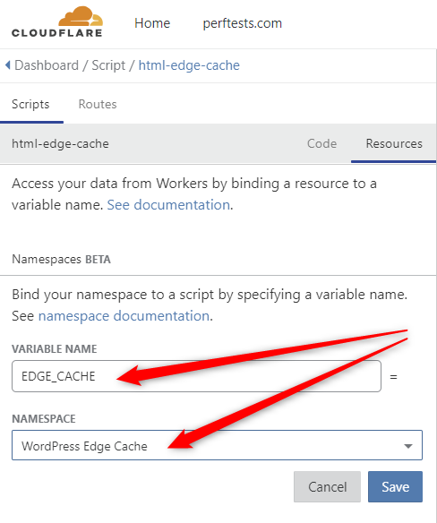

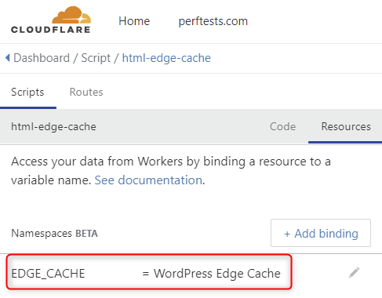

Inserting the worker code is just a matter of copy/pasting the [worker code](https://raw.githubusercontent.com/cloudflare/worker-examples/master/examples/edge-cache-html/edge-cache-html.js) into the "Code" view of the editor. Make sure to delete the contents of any existing script before pasting the new script. After pasting the script make sure to hit the "Save" button at the bottom of the editor.

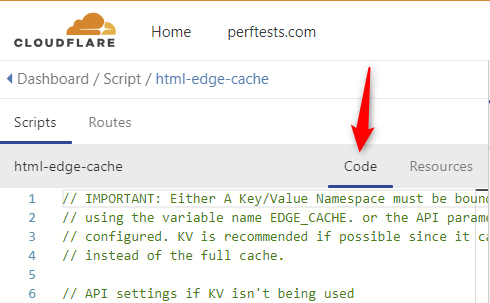

THe worker is not active until a route for it has been configured to tell it what URLs it should be invoked for. That is done in the "Routes" tab of the worker editor:

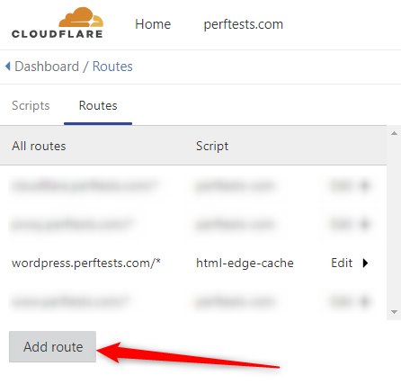

Make sure to configure a route that covers all of the pages for your site. There is no harm if it also includes more than just the HTML pages as everything else is passed through unmodified. It is usually easiest to just set up a wildcard route that covers all URLs for the domains:

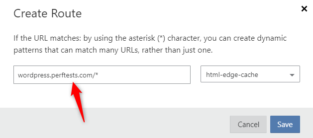

After saving the route the worker should be active for your zone and ready to cache HTML if the origin supports it (like [WordPress with the plugin](WordPress%20Plugin/)).
