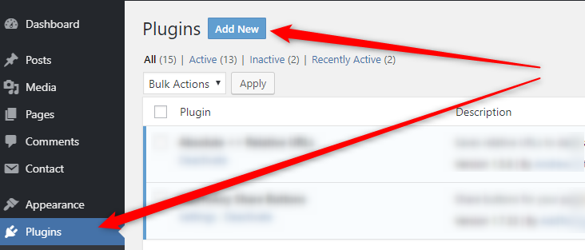
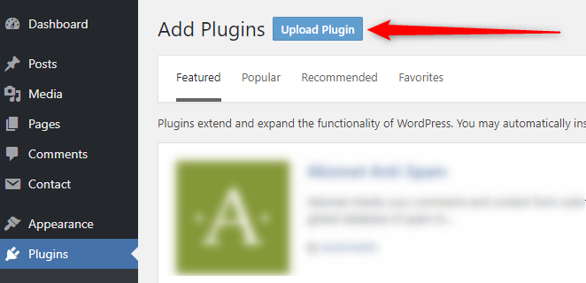
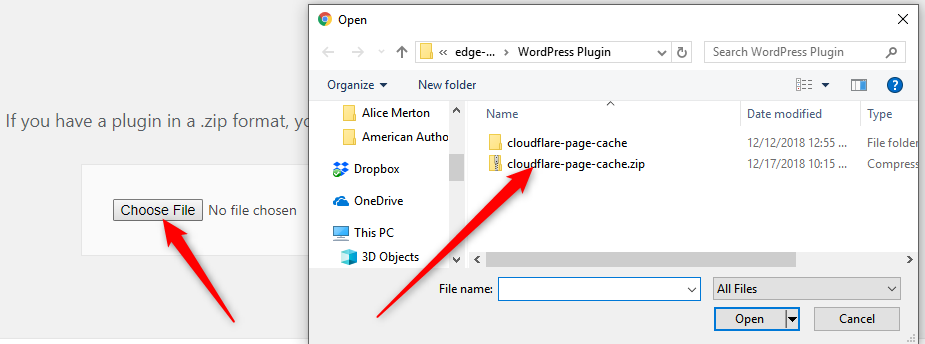
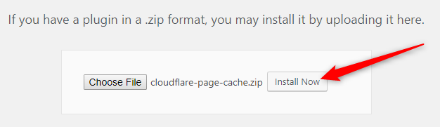
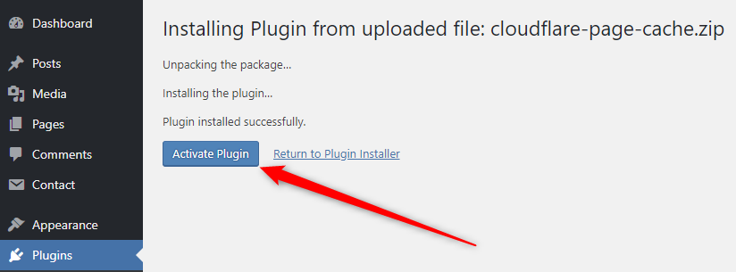
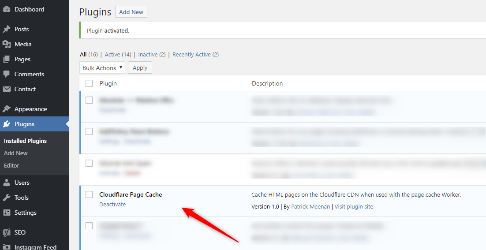

# WordPress Page Cache Plugin

Integrates with the [Edge Cache HTML worker](..) script to cache WordPress pages on the edge:

- Caches HTML on the Cloudflare edge for visitors that aren't logged-in (logged-in users bypass the cache).
- Automatically invalidates the cache when content is changed (including changes to the themes).

The plugin requires no configuration once installed and activated. As long as the plugin is active and the Worker is running for the domain the edge-caching support is enabled.

# Plugin Installation

The plugin is not (yet) available in the WordPress plugin directory and must be uploaded manually by an administrator.

Log into the WordPress dashboard for the site, go to the "Plugins" section and click on the "Add New" button:

From the gallery page click the "Upload Plugin" button to manually upload the plugin:

From the upload page select the "Choose File" button and select the [plugin zip file](https://github.com/cloudflare/worker-examples/raw/master/examples/edge-cache-html/WordPress%20Plugin/cloudflare-page-cache.zip) downloaded from this repository:

Select the "Install Now" button to upload and install the plugin:

After the plugin has been uploaded and installed it will still need to be activated. Click the "Activate Plugin" button from the install page.

Once activated the plugin will be listed in the plugins page with a "Deactivate" link below it. At this point the plugin is installed and working.

# Updating Plugin

To update the plugin after it has been installed and activated you first need to deactivate and delete the installed plugin from the plugins page and go through the installation steps again.
