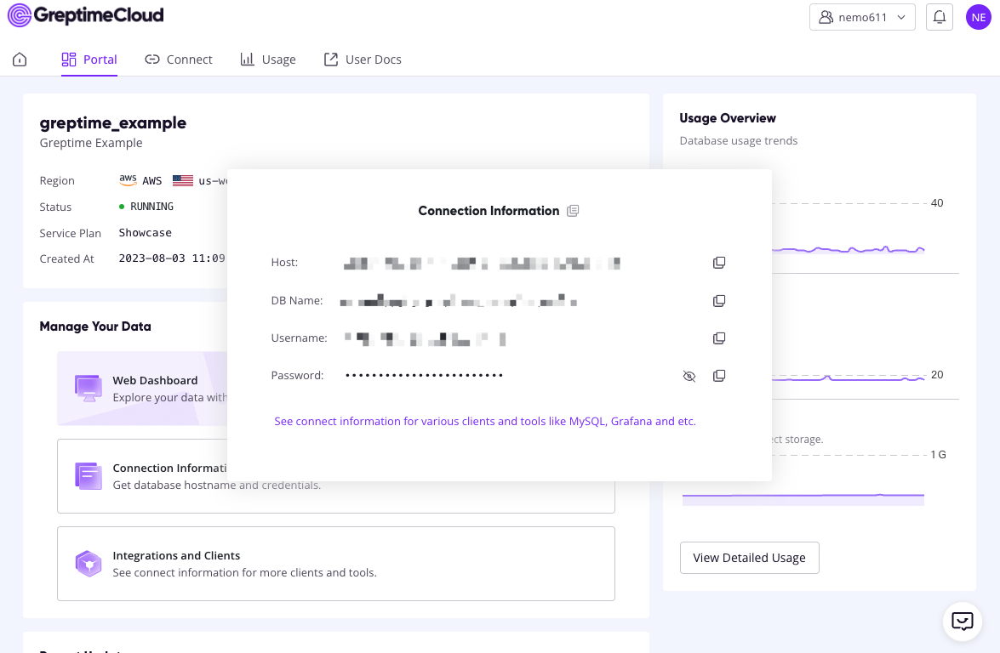

# Template: worker

[](https://deploy.workers.cloudflare.com/?url=https://github.com/cloudflare/workers-sdk/tree/main/templates/worker-gre)
ptime

A simple template for kick starting a Cloudflare worker project.

## Setup

To create a `my-project` directory using this template, run:

```sh
$ npx wrangler generate my-project worker-greptime
# or
$ yarn wrangler generate my-project worker-greptime
# or
$ pnpm wrangler generate my-project worker-greptime
```

## Usage

Greptime is an open source, cloud-native time-series database with a distributed solution.

Using npm, download and install the code.

```bash
$ npm install --save greptime
```


For node environment：

```js
var base = require('greptime')
```

For webpack or similar environment：

```js
import base from 'greptime'
```

For requirejs environment:

```js
requirejs(['node_modules/greptime/dist/index.aio.js'], function (base) {
  // do something...
})
```

For browser environment:

```html
<script src="node_modules/greptime/dist/index.aio.js"></script>
```

### query by sql

```js
import Greptime from greptime
let { sql } = Greptime({})
try {
  let res = await sql.select('*').from('script').query()
  console.log(
    '====================\n',
    res.sql,
    '\n-------------------\n',
    res.schema,
    '\n-------------------\n',
    res.rows.length,
    '\n====================\n'
  )
} catch (error) {
  console.log(`show error:`, error)
}
```

### query by promQL

```js
import Greptime from greptime
let { promQL } = Greptime({})
try {
  let res = await promQL.query('demo').duration('1m').run()
  console.log(`res:`, res.data)
} catch (error) {
  console.log(`error:`, error)
}
```

## Config

You need to configure the connection information in `wrangler.toml`

``` toml
[vars]
HOST =
DBNAME =
USERNAME =
PASSWORD =
```

You can create a free service using GreptimeCloud's hobby plan and then copy this information directly from the console



Start your time series data journey and enjoy it.